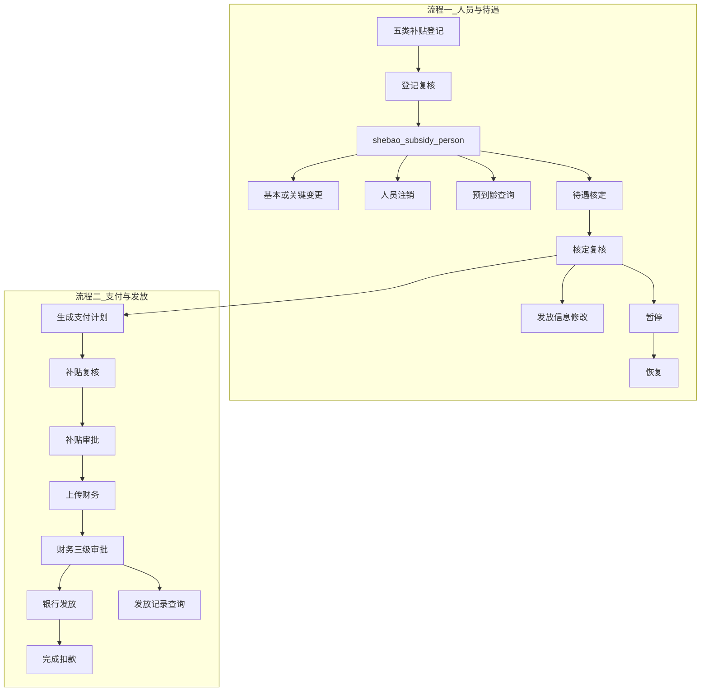

# 系统需求实现说明

> **文档性质**：由现行代码反推的「已实现需求」说明，描述系统实际做成了什么。  
> **非**用户需求说明书；口述流程见 `spec/管理使用流程.md`，差距与缺陷见 `doc/遗留问题列表.md`。  
> **代码基准**：`langfang-shebao` 模块 + `ruoyi-ui/src/views|api/shebao`，文档整理日期 2026-08-02（同日修订：核定通过回写 `person_status`）。

---

## 0. 总览

系统承载廊坊县级养老补贴发放。两大主流程：

1. **人员与待遇**：主数据登记 → 复核 →（变更/注销）→ 预到龄 → 核定 →（发放信息修改 / 暂停 / 恢复）；认证菜单存在但业务未落地。
2. **支付与发放**：按补贴类型生成支付计划 → 补贴侧复核/审批 → 上传财务 → 财务三级审批 → 银行导出/提交 → 失败导入 → 标记完成扣款 → 发放记录只读查询。

业务代码集中在 Maven 模块 `langfang-shebao`；若依 `ruoyi-system` 仅提供用户/菜单/字典等系统能力。



---

## 1. 主数据与状态字段

### 1.1 人员主表

| 表 | 实体 | 说明 |
|----|------|------|
| `shebao_subsidy_person` | `SubsidyPerson` | 被补贴人主数据；登记时由 `SubsidyPersonRegistrationHelper` 创建或关联 |

| 字段 | 实现口径 | 谁写 |
|------|----------|------|
| `person_status` | `0` 未享受 / `1` 享受（字典名 `shebao_person_status`） | 登记新建默认 `"0"`；**核定复核通过写 `"1"`**（`approveReview` → `markPersonAsBenefiting`）；历史导入可写 |
| `subsidy_status` | `0` 在保 / `1` 终止 | 登记默认 `"0"`；注销复核通过写 `"1"` |
| `is_alive` | `0` 否 / `1` 是 | 死亡类注销复核通过时写 `"0"` |
| `status` | `0` 正常 / `1` 停用 | 通用启用停用 |
| `death_date` | 日期 | 注销通过时写入（字段复用注销时间） |

存量已核定但未享受的数据用 `sql/fix_person_status_after_determination_20260802.sql` 回填。

### 1.2 补贴类型编码与跨模块映射

多轨编码本身可接受；关键是模块间流转时是否有正确映射。

| 场景 | 编码示例 |
|------|----------|
| 登记子表 / 复核 | `land_loss_resident`、`expropriatee`、`demolition_resident`、`village_official`、`teacher` |
| 核定明细 / 支付计划 | `land_loss`、`demolition`、`village_official`、`expropriatee`、`teacher` |
| 旧枚举 `SubsidyTypeEnum` | 数字 `"1"`～`"5"` |
| 字典 `shebao_subsidy_type` | 字符串码（与核定/支付侧接近） |

**主路径映射（核对结论：正确）**

| 环节 | 映射方式 |
|------|----------|
| 登记表 → 核定 prepare | 查 `shebao_land_loss_resident` 等表后，写出短码 `land_loss` / `demolition` / `village_official`（`BenefitDeterminationServiceImpl.prepareByIdCardNo`） |
| 核定明细 → 支付计划 | 同源短码；预览/生成按 `bdi.subsidy_type = #{subsidyType}` 过滤 |
| 支付计划 → 待复核登记拦截 | `PaymentPlanDetailMapper.countPendingRegistrationReview`：`land_loss`→失地表、`demolition`→拆迁表、`expropriatee`→被征地表、`village_official`→村干部表 |
| 展示 / 财务账户 / 银行短名 | `case` 同时兼容短码与登记长码（如 `land_loss` 与 `land_loss_resident`） |

**残留风险（非主路径）**：历史数据或导入若把长码写入核定明细，支付计划按短码过滤会漏人；列表筛选对数字码 `1` 有双码兼容（`BenefitDeterminationMapper`），日常生成计划用短码。教龄 `teacher` 在支付待办拦截的 `choose` 中落入 `otherwise → 0`（当前前端支付类型也基本不开放教龄）。

### 1.3 登记子表审批状态

常量：`SubsidyApprovalStatus` → `draft` / `pending_review` / `approved` / `rejected`。

**现行五类独立登记保存**：直接置 `pending_review`（跳过草稿）。`draft` 仍出现在统一 registration 的 submit 接口与部分前端页按钮逻辑中。

### 1.4 实体关系（流程一核心）

```
shebao_subsidy_person
  ├─1:N─ shebao_land_loss_resident
  ├─1:N─ shebao_expropriatee_subsidy
  ├─1:N─ shebao_demolition_resident
  ├─1:N─ shebao_village_official (+ position)
  ├─1:N─ shebao_teacher_subsidy
  ├─1:N─ shebao_person_cancel
  ├─1:N─ person_key_info_modify
  └─1:N─ benefit_determination
           ├─1:N─ benefit_determination_item  (benefit_status: 0正常/1暂停)
           ├─1:N─ shebao_benefit_suspension (+ item)
           └─1:N─ shebao_benefit_resume (+ item)

approval_log  (business_type: person_register / benefit_determination / …)
-- 预到龄：即时查询导出，无批次表（存量 DROP 见 sql/drop_benefit_notice_batch_tables_20260802.sql）
```

表名前缀不完全统一：`benefit_determination*`、`person_key_info_modify`、`approval_log` 无 `shebao_` 前缀。

---

## 2. 流程一：人员与待遇

每节结构：业务目的 → 入口 → 前置条件 → 状态流转 → 落库 → 副作用 → 已知边界。

### 2.1 人员登记

**业务目的**：按补贴类型为人员建立资格登记，并进入复核。

**入口（主路径，五类独立）**

| 类型 | API 前缀 | Service |
|------|----------|---------|
| 失地居民 | `/shebao/landLossResident` | `LandLossResidentServiceImpl` |
| 被征地 | `/shebao/expropriateeSubsidy` | `ExpropriateeSubsidyServiceImpl` |
| 拆迁 | `/shebao/demolitionResident` | `DemolitionResidentServiceImpl` |
| 村干部 | `/shebao/villageOfficial` | `VillageOfficialServiceImpl` |
| 教龄 | `/shebao/teacherSubsidy` | `TeacherSubsidyServiceImpl` |

前端主页面：`views/shebao/landLossResident`、`expropriateeSubsidy`、`demolitionResident`、`villageOfficial`、`person/teacher` 等（均为独立模块）。

**前置条件**（`SubsidyPersonRegistrationHelper`）

- 按身份证查主表；不存在则新建：`status=0`、`personStatus=0`、`subsidyStatus=0`、`isAlive=1`。
- 已存在则要求 `subsidyStatus≠1` 且 `isAlive≠0`。
- 同类型重复登记由各 Service 拦截。
- **已存在人员不再更新主表基础信息**。

**状态流转**

```
新增/修改保存 → pending_review
pending_review → approved | rejected   （复核，见 2.2）
rejected → 再改保存 → pending_review
approved → 不可再改（各 update 校验）
```

**落库**：对应补贴子表 + 必要时新建 `shebao_subsidy_person`。

**副作用**：无直接改 `subsidy_status`（保持新建默认值）；`person_status` 仍为未享受，待核定通过后置享受。

**已知边界**：产品口径为「保存即送审」，无独立草稿态；教龄菜单在测试库可能停用，页面若保留草稿按钮文案需与后端对齐。

---

### 2.2 登记复核

**业务目的**：复核人通过或驳回五类登记。

**入口**：`/shebao/person/review` → `PersonReviewController` / `PersonReviewServiceImpl`。  
前端：`views/shebao/person/review`。

**前置条件**：记录当前必须为 `pending_review`。

**状态流转**：`pending_review` → `approved` | `rejected`；写 `approval_log`（`person_register`）。

**落库**：更新对应子表 `approval_status`；**不回写**主表 `person_status` / `subsidy_status`。

**已知边界**

- 列表默认只查待复核。
- 教龄可通过/驳回，但详情接口抛「请使用教龄补助模块查看详情」。
- 支持类型码：`land_loss_resident` / `expropriatee` / `demolition_resident` / `village_official` / `teacher`。

---

### 2.3 人员信息变更

**业务目的**：修正人员基本信息或关键身份信息（姓名/身份证）。

**入口**：`/shebao/person/modify` → `PersonKeyInfoModifyServiceImpl`。  
表：`person_key_info_modify`。前端：`views/shebao/person/modify`。

**类型**

| modifyType | 审核层级 | 通过后回写 |
|------------|----------|------------|
| `basic`（空默认按业务区分） | 二级：draft → pending_review → approved | 非关键字段 |
| `key` | 三级：… → pending_approve → approved | 含姓名/身份证 |

**前置条件**

- 同人存在未办结申请（除 `approved` 外均算未完成，**含 `rejected`**）则不可新建。
- basic 禁止改姓名/身份证；key 改身份证做唯一性校验。
- `@BlockIfCurrentMonthPaymentPlan`：当月存在支付计划则阻断写操作。

**状态流转**

```
草稿保存 → draft
submit: draft|rejected → pending_review
review: basic 通过 → approved；key 通过 → pending_approve；驳回 → rejected
approve(仅 key): pending_approve → approved | rejected
```

**落库**：申请表 + 通过后回写 `shebao_subsidy_person`。

---

### 2.4 人员注销

**业务目的**：终止人员参保资格（主路径带复核）。

**入口（主路径）**：`/shebao/personCancel` → `PersonCancelServiceImpl`。  
前端：`views/shebao/person/cancel`（依赖动态菜单；静态 `router/shebao.js` 未挂 cancel 子路由）。

**状态流转**

```
新增 → pending_review
修改（非 pending_review/approved）→ 再置 pending_review
复核通过 → approved + applyApprovedCancelToPerson
复核驳回 → rejected
```

**通过后副作用**（`applyApprovedCancelToPerson`）

- `subsidyStatus = "1"`
- 写 `deathDate`（注销时间）
- 仅 `cancelReason=dead` 时 `isAlive=0`

**注销入口**：仅菜单「人员注销登记」→ `person/cancel` → `/shebao/personCancel`（带复核）。旧无复核接口 `/shebao/subsidyPerson/cancel` 已删除。


---

### 2.5 预到龄

**业务目的**：按预到龄年月（或身份证）查询即将/已满 60 岁且尚未享受待遇的人员，供导出通知。

**入口**：`GET /shebao/benefit/notice/list`、`POST .../export` → `BenefitNoticeServiceImpl`。  
前端：`views/shebao/benefit/notice`。

**前置条件（按 noticeMonth 查询时，SQL）**

- 生日 +60 年 ≤ noticeMonth
- `subsidy_status='0'`、`person_status='0'`（未享受；核定通过后为享受，自然退出名单）
- 至少一种已 `approved` 的失地 / 拆迁 / 村干部（村干部要求无违规）
- noticeMonth 与 idCardNo 二选一

**落库**：不落库。实时查人员与登记子表后导出；批次表已废弃，存量清理 SQL 见 `sql/drop_benefit_notice_batch_tables_20260802.sql`（**由用户执行**）。

---

### 2.6 待遇认证

**业务目的（口述）**：每年 4/10 月认证，未认证暂停发放。

**实现现状**：**未实现**。

- 后端 `BenefitCertificationController`：`submit` / `batchSubmit` / `history` 均为 TODO，直接返回成功；列表误用失地居民查询。
- 前端 `management/certification/index.vue`：API 调用为 TODO；页面状态用 `'0'/'1'`，字典 `certification_status` 为 `uncertified/april/october`。

---

### 2.7 待遇核定与核定复核

**业务目的**：对已满 60 岁且补贴身份已复核的人员，核定享受项目、标准、银行卡与补发，经复核后进入可发放池。

**入口**

| 阶段 | API | Service 方法 |
|------|-----|--------------|
| 准备 | `GET /shebao/benefit/determination/prepare` | `prepareByIdCardNo` |
| 草稿 | `POST .../draft` | `saveDraft` |
| 提交 | `POST .../submit/{id}` | `submitForReview` |
| 复核列表/通过/驳回 | `/shebao/benefit/review` | `approveReview` / `rejectReview` |

前端：`benefit/determination`、`benefit/review`。

**前置条件（prepare）**

- 人员存在、年龄满 60、相关补贴登记已复核通过。
- `alreadyDetermined`：存在任意核定记录 **或** 已有 approved 核定 **或** `person_status≠0`。

**状态流转（核定主表 `approval_status`）**

```
saveDraft → draft（仅 draft|rejected 可改）
submitForReview → pending_review（校验银行卡等字段；未校验当前状态）
approveReview → approved + 主表 person_status=1（享受）
rejectReview → rejected
```

**明细**：`benefit_determination_item`，补贴类型用 `land_loss` / `demolition` / `village_official` 等；`benefit_status`：`0` 正常 / `1` 暂停。补发字段与后续支付计划衔接（`supplement_pay_status` 等，见支付流程）。

**副作用**：`approveReview` 调用 `markPersonAsBenefiting`，将关联 `shebao_subsidy_person.person_status` 置为 `"1"`。

**已知边界**：submit/approve/reject 仍缺严格状态机前置校验（见遗留问题 ISS-006）。

---

### 2.8 发放信息修改

**业务目的**：修改已核定人员的发放银行、账号、领取人等。

**入口**：前端 `management/modify`；调用核定 `PUT /shebao/benefit/determination`（`updateBenefitDetermination`）。无独立 Controller。

**前置条件**：前端列表过滤 `approvalStatus=approved`；**后端 PUT 无状态校验**。

**状态流转**：无独立审批；直接改核定主表字段（如 `grantOrg`、`accountName`、`relationToInsured`、`bankAccount`、`grantRemark`）。

**已知边界**：与审批配置中 `info_modify` 三级审批设计不一致；人员关键信息变更走的是另一套 `person/modify`。

---

### 2.9 待遇暂停

**业务目的**：按核定明细暂停一项或多项待遇，可选触发财务追回。

**入口**：`POST /shebao/management/suspension/pause` → `BenefitSuspensionServiceImpl`。  
前端：`management/suspension`。权限码：`shebao:management:suspension:*`。

**前置条件**：核定已 `approved`；所选明细当前非暂停。

**落库 / 副作用**

- 写 `shebao_benefit_suspension` + item
- 明细 `benefit_status=1`、`pause_start_month`
- 可联动 `FinanceBenefitRecoveryService` 生成追回

**原因字典**：`pause_reason`（`dead` / `unauthentic` / `prison` / `missing` / `other`）。遗留 `suspension_reason` 已从初始化脚本移除；测试库清理脚本只删多余字典并 DROP 人员表死列，不动已有 `pause_reason`。

---

### 2.10 待遇恢复

**业务目的**：恢复已暂停明细，并可产生补发。

**入口**：`POST /shebao/management/resume` → `BenefitResumeServiceImpl`。  
前端：`management/resume`。

**前置条件**：明细 `benefit_status=1`；至少一条 `needResume=1`。

**落库 / 副作用**

- 写 resume 主子表
- 明细回 `benefit_status=0`
- 关闭对应 suspension item 的 `pause_active=0`
- 补发进入后续支付计划候选（`supplement_pay_status`）

---

### 2.11 当月支付计划锁

注解 `@BlockIfCurrentMonthPaymentPlan` + `CurrentMonthPaymentPlanLockAspect`：  
当前自然月业务期**存在任意未删除支付计划**即禁止相关写操作（变更、认证提交、部分待遇写等）。与计划是否已审批通过无关。

**业务口径**：按设计保留——只要当月已生成计划（含草稿）即锁定，不视为缺陷。

---

## 3. 流程二：支付计划与发放

状态机真源：`PaymentPlanServiceImpl` 私有常量；前端标签：`views/shebao/payment/plan/planUiShared.js`。

旧发放体系（`shebao_subsidy_distribution`、`distribution_batch`、`shebao_distribution_review`）已由 `sql/drop_old_distribution_tables_20260801.sql` 废弃；现行统一为 `shebao_payment_plan*`。

### 3.1 实体关系

```
shebao_payment_plan
  ├─1:N─ shebao_payment_plan_summary   (按发放机构汇总)
  ├─1:N─ shebao_payment_plan_detail
  │       ├─ determination_id / determination_item_id
  │       ├─ subsidy_person_id
  │       └─ supplement_source + supplement_source_id
  │             → benefit_determination_item | shebao_benefit_resume_item
  └─1:N─ shebao_payment_plan_audit     (stage: subsidy | finance)

完成发放 → FinanceAccountService.deductForSubsidyDistribution
            → finance_account + 流水
```

主表三轴字段：`approval_status`、`finance_status`（空=未进财务）、`distribution_status`。

### 3.2 支付计划生成

**业务目的**：按业务期 + 核定方式 + 补贴类型，从已批核定明细汇总生成支付计划。

**入口**：`POST /shebao/payment/plan/preview|generate|save` → `PaymentPlanServiceImpl`。  
权限：`shebao:payment:plan:generate`。前端：`payment/plan`。

**数据来源**

- 已审批核定明细：`benefit_determination` + item（`approval_status=approved`，`benefit_status` 默认正常）
- 补发候选：核定/恢复补发，`attachSupplementCandidates`；保存后 `claimSupplementsAfterInsert` 标为已纳入（`1`）

**前置条件**

- `validateNoPendingRecords`：同补贴类型不得有未复核登记、未审核核定
- `assertNoDuplicateActivePlan`：同业务期 + 核定方式 + 补贴类型仅一条有效计划
- `determinationType=second`：**直接拒绝**「二次发放暂未实现」

**状态**：保存可为 `draft`；生成/提交为 `pending_review`。  
批次号：`yyyyMM` + `01/02` + 三位序号；插入后不再改。

**已知边界**：二次发放前端仍可选、后端拒绝。正常发放明细 `payment_month` 写入业务期 `yyyy-MM`（供银行附言等使用）。

---

### 3.3 补贴侧审核（复核 + 审批）

**入口**：统一 `POST /shebao/payment/plan/{id}/status`，body `{ targetStatus, remark }`。  
前端页：`payment/review`、`payment/approve`（无独立后端 Controller）。

**允许流转**（`validateTransition`）

| 当前 | 目标 | 含义 |
|------|------|------|
| draft / review_rejected / approve_rejected / finance_rejected | pending_review | 提交 |
| pending_review | pending_approve | 复核通过 |
| pending_review | review_rejected | 复核驳回（备注必填） |
| pending_approve / review_rejected | pending_review | 撤销复核 |
| pending_approve | approved | 审批通过 |
| pending_approve | approve_rejected | 审批驳回（备注必填） |

写 audit，`approval_stage=subsidy`。

**撤销计划**：`POST .../{id}/revoke` — 草稿/各类驳回/待复核且未进财务 → 物理删除计划及明细/汇总/审核，并释放已纳入补发。

---

### 3.4 上传财务

**入口**：`POST /shebao/payment/plan/{id}/finance-submit`。  
权限：`shebao:payment:batch:upload`。前端：`payment/upload`。

**前置条件**：`approval_status=approved` 且 `finance_status` 为空。

**流转**：`finance_status: null → pending_finance`；audit stage=`finance`。

---

### 3.5 财务三级审批

**入口**：`FinanceBatchController` `/shebao/finance/batch`  
动作：`finance-pass|reject`、`review-pass|reject`、`approve-pass|reject` → 统一 `changeFinanceStatus`。

**流转**

| 当前 | 通过 | 驳回 |
|------|------|------|
| pending_finance | finance_pending_review | finance_rejected |
| finance_pending_review | finance_pending_approve | finance_rejected |
| finance_pending_approve | finance_approved | finance_rejected |

**驳回**：备注必填；同步将 `approval_status` 置为 `finance_rejected`；`finance_status` 保留 `finance_rejected`。业务再提交时 `clearFinanceStatus` 清空财务状态以便重传。

**财务最终通过副作用**

1. `markSupplementsPaid`：补发 `1 → 2`
2. `stampDistributionDate`：明细 `distribution_date = 当天`

---

### 3.6 银行发放与结果上传

**入口**：`FinanceBankController` `/shebao/finance/bank`。前端：`finance/bank`、`finance/failure`。

| 步骤 | API / 方法 | 条件与效果 |
|------|------------|------------|
| 列表 | bank/list | 强制 `finance_status=finance_approved` |
| 查银行 | `/{id}/banks` | 按 `grant_org` 映射廊坊/中行 |
| 导出 | `/{id}/export?bank=` | 廊坊 XLS / 中行 CSV |
| 提交银行 | `/{id}/submit` | `distribution_status → submitted` |
| 导入失败 | `/{id}/import-fail` | 仅 submitted；按身份证 `markFailedByIdCard` |
| 标记完成 | `/{id}/complete` | 未失败标 success；扣财务账户；→ `completed` |

明细结果：`distribution_result` = `success` | `failed`。

**发放结果上传**：即「导入失败数据」；失败处理页仅列表，页面明示信息更正/重新发放/人工处理待实现。前端 `handleFailure` → `/shebao/finance/failure/handle` **无后端实现**。

**已知边界**

- 财务通过后主表 `distribution_status` 常为 `null`，列表用 `ifnull(...,'pending')` 兼容。
- 同计划同证件多行导入失败会一并标记。
- 扣款失败则整单无法完成。

---

### 3.7 发放记录查询

**入口**：`GET /shebao/distribution/record/list`、`POST .../export` → `DistributionRecordServiceImpl`（只读包装明细查询）。  
前端：`distribution/record`。菜单「补贴发放记录」与「发放明细」可共用同一页面（见 `sql/distribution_record_menu_20260801.sql`）。

**范围**：`finance_status = finance_approved` 的明细。

**派生 payStatus**：计划未 `completed` → `distributing`；明细 `failed` → `failed`；否则 `paid`。

居民查询中的预发放/发放记录亦读同一明细表。

---

### 3.8 三轴状态一览

**A. `approval_status`**

`draft` → `pending_review` → `pending_approve` → `approved`；驳回态：`review_rejected` / `approve_rejected` / `finance_rejected`。

**B. `finance_status`**

空 → `pending_finance` → `finance_pending_review` → `finance_pending_approve` → `finance_approved` | `finance_rejected`。

**C. `distribution_status`**

约定 `pending`（库内可为 null）→ `submitted` → `completed`。

注意：`finance_rejected` 同时出现在 A、B 两字段，语义需按字段区分。

---

## 4. 附录

### 4.1 模块与代码落点

| 领域 | 后端包 | 前端 |
|------|--------|------|
| 人员登记/复核/变更/注销 | `controller`/`service.impl` 下 Person*、五类 *Resident/*Subsidy* | `views/shebao/person|landLossResident|...` |
| 待遇 | Benefit*、management 下 suspension/resume/certification | `views/shebao/benefit|management` |
| 支付/财务/银行/发放记录 | PaymentPlan*、Finance*、DistributionRecord* | `views/shebao/payment|finance|distribution` |

### 4.2 菜单权限（暂停/恢复）

运行库 `sys_menu` 与代码一致（已核对测试库）：

| 功能 | 运行库 / Controller / 前端 |
|------|---------------------------|
| 待遇暂停 | `shebao:management:suspension:list/add/query` |
| 待遇恢复 | `shebao:management:resume:list/add/query`（独立菜单） |
| 核定 | `shebao:benefit:determination:*` |

初始化脚本 `sql/refactor/04_menu_config.sql` 已与上述 perms 对齐（含暂停/恢复独立菜单及 add/query 按钮）。

### 4.3 与口述流程对照（`spec/管理使用流程.md`）

| 口述能力 | 实现情况 |
|----------|----------|
| 五类人员登记两级审核 | **已实现**（保存即送审；draft 流程不完整） |
| 基本信息修改两级 / 关键三级 | **已实现** |
| 预到龄通知导出 | **已实现**（即时查询+导出；无批次落库） |
| 待遇核定（含补发、档案）；核定后人员状态=享受 | **大部分已实现**；批量上传等能力需以页面为准 |
| 发放信息修改 | **部分实现**（直改核定，无审批） |
| 暂停 / 恢复 / 追回 | **已实现**（追回到账等细节见财务模块） |
| 待遇认证 4/10 月 | **未实现** |
| 被征地参保补贴独立模块 | **边界外/待完善**（与被征地登记不同） |
| 支付计划生成→复核→审批→上传财务 | **已实现** |
| 财务审批→银行发放 | **已实现** |
| 二次发放 | **未实现**（接口拒绝） |
| 发放失败后更正/重发 | **未实现**（仅导入失败+列表） |
| 发放记录查询 | **已实现**（只读支付计划明细） |

### 4.4 相关演进 SQL（支付侧近期）

| 文件 | 作用 |
|------|------|
| `sql/payment_plan_batch_no_index_20260731.sql` | 批次号唯一约束改为普通索引 |
| `sql/payment_plan_finance_reject_rollback_20260731.sql` | 修复财务驳回未回退审批态的历史数据 |
| `sql/payment_plan_supplement_20260801.sql` | 补发纳入字段 |
| `sql/payment_plan_detail_person_distribution_date_20260801.sql` | 明细人员与发放日期 |
| `sql/distribution_record_menu_20260801.sql` | 发放记录菜单切换 |
| `sql/drop_old_distribution_tables_20260801.sql` | 删除旧发放三表 |

---

## 5. 修订说明

| 日期 | 说明 |
|------|------|
| 2026-08-02 | 初稿：两大流程反推 |
| 2026-08-02 | 删除旧注销接口 `/shebao/subsidyPerson/cancel` 及前端死代码；注销仅保留 PersonCancel |

本文档随代码迭代应同步更新。发现实现与本文不符时，以代码为准并修订本节。缺陷与技术债见 `doc/遗留问题列表.md`。
