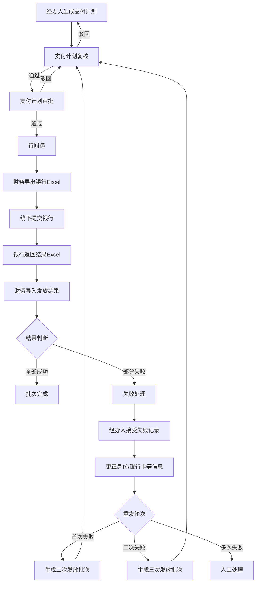

# 支付工作详细设计文档

**文档版本**: v1.1  
**创建日期**: 2026-03-15  
**适用范围**: 廊坊社保管理系统 / 支付计划管理 + 财务管理 / 支付工作闭环  
**设计阶段**: 实施补充设计

---

## 一、背景与目标

### 1.1 业务背景

当前系统中，支付相关菜单已经具备基础页面和部分接口骨架，包括：

- 支付计划生成
- 支付计划复核
- 支付计划审批
- 财务批次管理
- 银行发放
- 失败处理

但现状仍属于“半成品”：

- 支付计划已能生成单条发放记录，部分场景可按预到龄通知批次生成
- 复核、审批、财务等环节已有菜单和控制器骨架
- 财务提交银行、导入银行结果、失败重发等关键节点仍存在 `TODO`
- 前后端部分接口和状态口径不完全一致
- 当前不对接银行系统，而是通过 Excel 导出与导入完成结果确认
- 测试环境数据库结构曾落后于代码口径，现已补充最小升级脚本用于联调

因此需要把支付工作整理为一条可说明、可实施、可测试的完整闭环链路。

### 1.2 设计目标

本次补充设计的目标不是引入直连银行，而是在当前“Excel 导出/导入”模式下，把支付业务整理成完整闭环：

- 以“支付计划生成”作为支付工作的起点
- 形成“经办 -> 复核 -> 审批 -> 财务 -> 结果导入 -> 失败反馈 -> 二次/三次发放”的闭环
- 区分“当前已实现”和“目标设计”，避免把未落地能力写成已完成
- 为后续开发、联调、测试、验收提供统一口径

### 1.3 范围与边界

本文档按两层口径描述：

- `当前实现`：仓库中已有菜单、页面、控制器、服务实现或可见骨架
- `目标设计`：为完成支付闭环所需补齐的能力

本次设计明确不包含：

- 银行直连接口
- 银行回盘专线或文件网关
- 财务总账、会计凭证等外部财务系统集成

本次设计明确包含：

- 支付计划生成
- 支付计划复核与审批
- 财务导出银行文件、提交银行、导入结果
- 发放失败反馈与重发
- 二次、三次发放闭环

---

## 二、角色与职责

| 角色 | 页面职责 | 流程职责 |
|------|----------|----------|
| 经办人 | 支付计划生成、查询明细、导出、失败记录接受、更正信息、发起重发 | 支付工作的发起人和失败修正责任人 |
| 复核人 | 支付计划复核、查看统计与明细、通过/驳回 | 控制业务口径与明细准确性 |
| 审批人（所长） | 支付计划审批、查看统计与明细、通过/驳回 | 形成业务最终审批结论 |
| 财务人员 | 生成银行文件、提交银行发放、导入银行结果、确认失败名单 | 负责发放执行与结果回写 |
| 系统管理员 | 菜单权限、字典、模板、导入导出规则维护 | 保障运行环境与权限正确 |

职责边界遵循需求说明书：

- 业务人员负责发放数据准备、修改、提交、失败更正
- 财务人员负责提交银行、导入结果、反馈失败
- 审核链路在业务侧完成后再提交财务

---

## 三、业务闭环设计

### 3.1 目标闭环总览

### 3.2 当前实现流程

当前仓库中已具备以下事实能力：

- 支付计划生成页可发起生成操作
- 支付计划可按记录查询
- 存在复核、审批、财务、失败处理菜单与页面骨架
- `PaymentPlanController` 已支持：
  - 列表查询
  - 单条生成
  - 单条审核通过/驳回
  - 按预到龄通知批次生成支付计划
- `DistributionBatchServiceImpl` 已支持批次状态流转：
  - `draft`
  - `pending_review`
  - `pending_approve`
  - `pending_finance`
- 已补充支付统计、批次创建、批次详情、银行文件导出、结果导入、失败处理统一入口
- 已补充测试环境数据库升级脚本：`sql/payment_closure_minimal_upgrade_20260315.sql`

当前尚未形成真正闭环的关键原因：

- 前端页面字段口径与后端返回字段仍有部分差异
- 银行导入模板、失败原因口径、重发追溯规则仍需联调固化
- 失败处理已补统一入口，但页面与业务规则还需要进一步收口
- 当前结构升级属于“最小可测试口径”，并非最终模型冻结版

### 3.3 实施版流程分解

#### 3.3.1 经办生成支付计划

经办人在“支付计划生成”页面按条件筛选待发放人员，确认后生成支付计划记录。

设计要求：

1. 支持按补贴类型、月份、区域、发放银行等条件筛选。
2. 生成前展示统计预览：人数、金额、银行分布。
3. 生成后形成支付记录清单，状态为 `draft` 或 `pending_review`。
4. 同一业务月份、同一补贴对象、同一业务来源不得重复生成。

#### 3.3.2 复核

复核人查看批次统计和明细：

- 通过：进入 `pending_approve`
- 驳回：退回经办人修正

复核重点：

- 发放人数是否异常
- 发放金额是否异常
- 银行账号、身份证号、补贴类型是否齐全
- 是否存在重复发放、跨批次重复、已停发人员

#### 3.3.3 审批

审批人对复核通过的支付批次做业务审批：

- 通过：进入 `pending_finance`
- 驳回：退回复核或经办

审批结论必须记录：

- 审批人
- 审批时间
- 审批意见

#### 3.3.4 财务提交银行

本系统不直连银行，财务环节采用“导出文件 + 线下提交 + 结果导入”模式：

1. 财务查看待财务批次。
2. 生成银行导入 Excel。
3. 线下将 Excel 提交给银行。
4. 银行返回结果 Excel。
5. 财务导入结果并更新批次、明细状态。

#### 3.3.5 结果导入与失败处理

导入结果后系统按明细拆分：

- 成功：更新为 `distributed`
- 失败：更新为 `failed`，记录失败原因

失败记录进入失败处理台账，由经办人接受并修正：

- 身份信息错误
- 银行卡号错误
- 账户名错误
- 银行退票或其他原因

修正后生成重发批次，再次进入复核、审批、财务流程。

---

## 四、状态机设计

### 4.1 批次状态

建议支付批次采用以下统一状态：

| 状态 | 含义 | 责任角色 |
|------|------|----------|
| `draft` | 草稿/刚生成未提交 | 经办人 |
| `pending_review` | 待复核 | 复核人 |
| `pending_approve` | 待审批 | 审批人 |
| `pending_finance` | 待财务处理 | 财务人员 |
| `submitted_bank` | 已提交银行 | 财务人员 |
| `result_imported` | 已导入银行结果 | 财务人员 |
| `completed` | 批次已完成 | 系统/财务 |
| `partial_failed` | 部分失败待处理 | 经办人 |
| `manual_closed` | 人工关闭 | 财务/管理员 |
| `rejected` | 驳回 | 业务链路相关角色 |

### 4.2 明细状态

建议支付明细采用以下状态：

| 状态 | 含义 |
|------|------|
| `draft` | 已生成计划但未入批次 |
| `pending_review` | 已提交待复核 |
| `pending_approve` | 复核通过待审批 |
| `pending_finance` | 审批通过待财务 |
| `submitted_bank` | 已导出/提交银行 |
| `success` | 银行反馈成功 |
| `failed` | 银行反馈失败 |
| `retry_pending` | 等待纳入二次/三次发放 |
| `manual` | 转人工处理 |
| `cancelled` | 作废/撤销 |

### 4.3 重发轮次

重发轮次建议采用字段 `retryCount`：

| 值 | 含义 |
|----|------|
| `0` | 首次发放 |
| `1` | 二次发放 |
| `2` | 三次发放 |
| `>=3` | 不再自动重发，转人工 |

### 4.4 当前实现与目标状态差异

当前代码中同时存在两套状态口径：

- 发放记录状态：`DistributionStatusEnum` 使用 `0/1/2/3/4`
- 批次状态：`DistributionBatch.status` 使用字符串，如 `draft/pending_review/...`

实施建议：

- 批次状态继续使用字符串枚举
- 明细状态统一使用字符串枚举，避免数字状态与批次状态混用
- 页面展示统一走字典映射，不直接暴露数据库原值
- 联调阶段允许数据库同时保留旧数字状态和新增字符串状态，但新增代码应优先读取字符串流程状态

---

## 五、页面与交互设计

### 5.1 页面入口

当前路由已配置以下页面：

| 菜单 | 路由 | 前端页面 |
|------|------|----------|
| 支付计划生成 | `payment/plan` | `ruoyi-ui/src/views/shebao/payment/plan/index.vue` |
| 支付计划复核 | `payment/review` | `ruoyi-ui/src/views/shebao/payment/review/index.vue` |
| 支付计划审批 | `payment/approve` | `ruoyi-ui/src/views/shebao/payment/approve/index.vue` |
| 上传财务系统 | `payment/upload` | `ruoyi-ui/src/views/shebao/payment/upload/index.vue` |
| 批次管理 | `finance/batch` | `ruoyi-ui/src/views/shebao/finance/batch/index.vue` |
| 银行发放 | `finance/bank` | `ruoyi-ui/src/views/shebao/finance/bank/index.vue` |
| 失败处理 | `finance/failure` | `ruoyi-ui/src/views/shebao/finance/failure/index.vue` |

### 5.2 支付计划生成页

页面职责：

- 选择补贴类型、发放月份、街道办等条件
- 预览统计结果
- 生成支付计划
- 将明细纳入批次

目标交互：

1. 查询待发放人员。
2. 点击“预览统计”查看人数、金额。
3. 点击“生成计划”写入支付明细。
4. 勾选明细后“创建批次”。
5. 批次进入待复核。

### 5.3 支付计划复核页

页面职责：

- 查看待复核批次
- 查看统计与明细
- 输入复核意见
- 通过或驳回

目标交互：

- 通过后进入 `pending_approve`
- 驳回后返回经办人修正

### 5.4 支付计划审批页

页面职责：

- 查看待审批批次
- 审批通过或驳回

目标交互：

- 通过后进入 `pending_finance`
- 驳回后退回复核/经办

### 5.5 财务批次/银行发放页

当前系统中财务操作分散在两个页面：

- `finance/batch`：侧重批次查看、生成文件、提交银行、导入结果
- `finance/bank`：侧重银行发放流水式操作

实施建议：

- 保留一个主页面用于财务发放
- 另一个页面作为批次查询或历史查询页
- 避免“同一动作在两个页面都能做，但接口不同”的情况

### 5.6 失败处理页

页面职责：

- 查询失败记录
- 查看失败原因
- 更正账号或身份信息
- 发起二次/三次发放
- 超过阈值时转人工处理

---

## 六、数据设计

### 6.1 当前依赖表

当前支付流程主要依赖：

- `shebao_subsidy_distribution`
- `distribution_batch`
- `benefit_determination`
- 各补贴业务主表

### 6.2 当前数据模型问题

当前模型存在以下问题：

- `distribution_batch` 能表示批次头，但缺少与明细的稳定绑定说明
- `shebao_subsidy_distribution` 缺少银行回盘、失败原因、重发链路字段
- 部分页面按“批次号”操作，部分接口按 `id` 操作，主键口径不统一
- 财务提交银行与导入结果缺少完整的持久化字段支撑

### 6.2.1 当前测试环境的实际数据库问题

在 2026-03-15 联调中，测试库实际暴露出以下结构差异：

- `benefit_determination` 缺少 `notice_batch_no`、`notice_detail_id`、`payment_plan_generated` 等字段
- `shebao_subsidy_distribution` 与 `distribution_batch` 缺少批次、审批、统计相关字段
- 旧数据中的 `subsidy_type` 同时存在字符串值和代码值两种口径

为保证支付闭环开发能够先进入测试，已补充最小结构升级脚本：

- `sql/payment_closure_minimal_upgrade_20260315.sql`

该脚本的定位是：

- 先补齐当前代码运行所需字段
- 先统一关键索引、状态字段和补贴类型口径
- 先把测试环境调整到“可启动、可联调、可回归”的状态

### 6.3 目标扩展字段

#### 6.3.1 扩展 `distribution_batch`

建议补充或统一以下字段：

| 字段 | 说明 |
|------|------|
| `batch_no` | 业务批次号 |
| `batch_type` | 首发/二次/三次/人工 |
| `approval_status` | 当前批次状态 |
| `payment_month` | 发放月份，建议显式持久化 |
| `bank_file_name` | 导出银行文件名 |
| `bank_submit_time` | 提交银行时间 |
| `bank_result_time` | 导入结果时间 |
| `success_count` | 成功人数 |
| `success_amount` | 成功金额 |
| `fail_count` | 失败人数 |
| `fail_amount` | 失败金额 |
| `source_batch_no` | 来源批次号，用于重发追溯 |
| `remark` | 审批/财务备注 |

#### 6.3.2 扩展 `shebao_subsidy_distribution`

建议补充以下字段：

| 字段 | 说明 |
|------|------|
| `batch_id` | 所属批次ID |
| `batch_no` | 所属批次号 |
| `payment_month` | 发放月份 |
| `approval_status` | 明细流程状态 |
| `bank_name` | 发放银行 |
| `bank_account_name` | 开户名 |
| `bank_account_no` | 银行账号 |
| `bank_result_status` | 银行结果状态 |
| `failure_reason` | 失败原因 |
| `failure_remark` | 失败说明 |
| `retry_count` | 重发次数 |
| `source_distribution_id` | 来源发放记录ID |
| `finance_submit_by/time` | 财务提交信息 |
| `result_import_by/time` | 结果导入信息 |

#### 6.3.3 已落地的最小结构升级口径

截至当前版本，已通过 `sql/payment_closure_minimal_upgrade_20260315.sql` 落地以下最小结构补齐：

| 表 | 已补齐内容 |
|------|------|
| `benefit_determination` | `approval_batch_no`、`notice_batch_no`、`notice_detail_id`、`id_card_no`、提交/复核字段、材料字段、`payment_plan_generated` |
| `shebao_subsidy_distribution` | `batch_no`、`batch_type`、`approval_status`、`rejection_reason`、复核/审批人及时点字段 |
| `distribution_batch` | 批次主表创建或补齐，包含 `approval_status`、成功/失败统计、银行提交/回盘时间、`del_flag` |

同时脚本还完成了两类数据回填：

- 把旧字符串 `subsidy_type` 统一转换为代码值
- 根据 `shebao_subsidy_distribution` 是否已存在发放明细，回填 `benefit_determination.payment_plan_generated`

### 6.4 建议索引

- 批次：`uk_batch_no`
- 批次：`idx_status_month`
- 明细：`idx_batch_id`
- 明细：`idx_batch_no`
- 明细：`idx_person_month`
- 明细：`idx_bank_result_status`
- 明细：`idx_retry_count`

---

## 七、接口设计

### 7.1 当前已存在接口

当前代码中已能确认的主要接口包括：

| 模块 | 接口 | 说明 |
|------|------|------|
| 支付计划 | `GET /shebao/payment/plan/list` | 查询发放记录 |
| 支付计划 | `GET /shebao/payment/plan/{id}` | 查询详情 |
| 支付计划 | `POST /shebao/payment/plan/statistics` | 预览统计 |
| 支付计划 | `POST /shebao/payment/plan/generate` | 生成支付记录 |
| 支付计划 | `POST /shebao/payment/plan/generateByNoticeBatch` | 按通知批次生成 |
| 支付批次 | `POST /shebao/payment/batch/create` | 创建批次 |
| 支付批次 | `GET /shebao/payment/batch/detail/{batchNo}` | 按批次号查询详情 |
| 支付计划复核 | `GET /shebao/payment/review/list` | 查询待复核批次 |
| 支付计划复核 | `POST /shebao/payment/review/approve/{id}` | 复核通过 |
| 支付计划复核 | `POST /shebao/payment/review/reject/{id}` | 复核驳回 |
| 支付计划审批 | `GET /shebao/payment/approve/list` | 查询待审批批次 |
| 支付计划审批 | `POST /shebao/payment/approve/approve/{id}` | 审批通过 |
| 支付计划审批 | `POST /shebao/payment/approve/reject/{id}` | 审批驳回 |
| 财务批次 | `GET /shebao/finance/batch/list` | 查询财务批次 |
| 财务批次 | `GET /shebao/finance/batch/detail/{batchNo}` | 按批次号查询详情 |
| 银行发放 | `GET /shebao/finance/bank/file/{batchNo}` | 导出银行文件 |
| 银行发放 | `POST /shebao/finance/bank/submit` | 提交银行 |
| 银行发放 | `POST /shebao/finance/bank/import` | 导入银行结果 |
| 失败处理 | `GET /shebao/finance/failure/list` | 查询失败记录 |
| 失败处理 | `POST /shebao/finance/failure/handle` | 更正/重发/人工处理统一入口 |

### 7.2 目标闭环接口

为实现完整闭环，建议形成以下接口组：

#### 7.2.1 支付计划生成

| 接口 | 说明 |
|------|------|
| `POST /shebao/payment/plan/preview` | 预览统计 |
| `POST /shebao/payment/plan/generate` | 生成支付记录 |
| `POST /shebao/payment/batch/create` | 按所选记录创建批次 |
| `POST /shebao/payment/batch/{id}/submitReview` | 批次提交复核 |

#### 7.2.2 复核审批

| 接口 | 说明 |
|------|------|
| `GET /shebao/payment/review/list` | 复核列表 |
| `POST /shebao/payment/review/approve/{id}` | 复核通过 |
| `POST /shebao/payment/review/reject/{id}` | 复核驳回 |
| `GET /shebao/payment/approve/list` | 审批列表 |
| `POST /shebao/payment/approve/approve/{id}` | 审批通过 |
| `POST /shebao/payment/approve/reject/{id}` | 审批驳回 |

#### 7.2.3 财务发放

| 接口 | 说明 |
|------|------|
| `GET /shebao/finance/batch/list` | 财务待办批次 |
| `GET /shebao/finance/batch/{id}` | 批次详情 |
| `GET /shebao/finance/bank/file/{batchNo}` | 导出银行Excel |
| `POST /shebao/finance/bank/submit` | 提交银行 |
| `POST /shebao/finance/bank/import` | 导入银行结果Excel |

#### 7.2.4 失败处理

| 接口 | 说明 |
|------|------|
| `GET /shebao/finance/failure/list` | 查询失败记录 |
| `GET /shebao/finance/failure/{id}` | 查看失败详情 |
| `POST /shebao/finance/failure/accept` | 经办接受失败反馈 |
| `POST /shebao/finance/failure/correct` | 更正信息 |
| `POST /shebao/finance/failure/retry/{id}` | 发起重发 |
| `POST /shebao/finance/failure/manual/{id}` | 转人工处理 |

### 7.3 当前接口差异说明

当前仓库存在以下明显差异，需要在实施时统一：

- 前端调用的 `/shebao/payment/batch/*`、`/shebao/finance/bank/*`、`/shebao/finance/failure/handle` 已补齐主入口，但页面字段映射仍需继续收口
- `finance/batch` 页与 `finance/bank` 页存在重复动作
- 有的接口按 `id`，有的页面按 `batchNo` 操作，建议统一“展示用批次号、接口内部主键ID”
- 数据库经过最小升级后已能支撑主链路测试，但并不代表最终数据模型已经冻结

---

## 八、权限设计

建议按动作拆分权限：

| 功能 | 权限建议 |
|------|----------|
| 支付计划列表 | `shebao:payment:plan:list` |
| 支付计划生成 | `shebao:payment:plan:generate` |
| 支付计划删除/撤销 | `shebao:payment:plan:remove` |
| 支付批次创建 | `shebao:payment:batch:create` |
| 支付计划复核 | `shebao:payment:review:*` |
| 支付计划审批 | `shebao:payment:approve:*` |
| 财务批次查看 | `shebao:finance:batch:list` |
| 生成银行文件 | `shebao:finance:bank:file` |
| 提交银行发放 | `shebao:finance:bank:submit` |
| 导入发放结果 | `shebao:finance:bank:import` |
| 失败处理 | `shebao:finance:failure:*` |

---

## 九、异常场景与边界设计

### 9.1 重点异常场景

- 同一人员同一月份重复生成支付计划
- 已进入批次的明细又被再次纳入其他批次
- 复核、审批、财务状态跨级跳转
- 银行结果 Excel 中批次号不匹配
- 银行结果 Excel 中存在系统内无对应明细
- 导入结果时同一明细重复回写
- 失败记录未更正就再次发起重发
- 三次发放后仍失败

### 9.2 设计要求

- 所有状态流转必须校验前置状态
- 银行结果导入必须幂等
- 重发必须继承原记录并保留追溯链
- 批次完成前必须校验“成功 + 失败 + 作废 = 批次总数”
- 所有驳回、失败、更正、人工处理都必须记录备注

### 9.3 当前主要风险

| 编号 | 风险 | 影响 |
|------|------|------|
| `PAY-01` | 前后端接口不一致 | 页面可见但动作失败 |
| `PAY-02` | 财务动作是占位实现 | 无法形成真实闭环 |
| `PAY-03` | 明细与批次绑定关系不清 | 难以追溯和回盘 |
| `PAY-04` | 失败重发无持久化链路 | 二次/三次发放不可审计 |
| `PAY-05` | 状态字段口径混用 | 统计和页面显示容易失真 |

---

## 十、测试设计指引

实施后建议重点验证：

1. 能否按条件生成支付计划并形成批次。
2. 复核通过后是否正确进入待审批。
3. 审批通过后是否正确进入待财务。
4. 是否可以导出银行 Excel 文件。
5. 导入银行结果后是否正确拆分成功/失败。
6. 失败记录是否可更正并发起二次发放。
7. 二次发放是否重新走复核、审批、财务链路。
8. 三次发放后失败记录是否能转人工处理。
9. 所有批次和明细是否可追溯来源批次与来源记录。

---

## 十一、结论

支付工作的闭环起点是“支付计划生成”，但只有在以下链路全部打通后，支付模块才算真正可用：

- 计划可生
- 批次可审
- 财务可提
- 结果可导
- 失败可退
- 重发可追

本次补充设计的最终口径为：

`支付工作应以支付计划为入口，以批次审核为主线，以银行结果导入为确认点，以失败重发为闭环补偿机制。`
