# 廊坊社保管理系统 - 概要设计文档

**文档版本**: v1.0
**创建日期**: 2025-01-16
**项目名称**: 县级养老补贴发放系统
**设计阶段**: 重构规划

---

## 一、项目背景

### 1.1 项目概述

廊坊社保管理系统是一个基于若依(RuoYi) v3.9.0框架开发的县级养老补贴发放系统,采用前后端分离架构。现有系统支持4种补贴类型(失地、被征地、拆迁、村干部)的管理和简单发放流程。

### 1.2 重构目标

由于需求调研上的偏差,需要对系统进行重构,主要包括:

1. **功能扩展**: 新增教龄补助,完善待遇管理流程(核定、发放、暂停、恢复、认证)
2. **流程优化**: 从简单的2级审核升级为多级审批流程(经办人→复核人→审批人→财务)
3. **角色分离**: 明确业务人员、财务人员、审计人员、系统管理员的职责边界
4. **界面重构**: 按照用例图重新设计用户界面菜单,实现不同角色看到不同的功能模块

### 1.3 演示目标

通过快速实现可演示的原型系统,达到以下目的:

- 核心业务流程可走通(人员登记、待遇核定、发放、失败处理)
- 6个角色可分别登录并看到相应菜单
- 完整的多级审批流程(2级和3级审核)
- 完整的待遇管理功能
- 完整的财务管理和统计报表功能
- 通过界面与用户交流需求,快速迭代

---

## 二、用户角色定义

### 2.1 角色划分

| 角色名称 | 角色代码 | 主要职责 | 审批节点 |
|----------|----------|----------|----------|
| **经办人(业务人员)** | operator | 人员信息管理、待遇核定、待遇管理、支付结算 | 提交人 |
| **复核人(业务人员)** | reviewer | 人员登记复核、待遇核定复核、支付计划复核 | 复核人 |
| **审批人(所长)** | approver | 关键信息修改审批、支付计划审批 | 审批人 |
| **财务人员** | finance | 财务发放、失败处理、账户管理 | 财务人员 |
| **统计管理员** | statistics_admin | 经办查询、报表统计、综合查询、追溯分析 | - |
| **系统管理员** | admin | 用户管理、权限分配、基础参数配置 | - |

### 2.2 角色职责边界

#### 2.2.1 经办人(业务人员)

**权限范围**:
- 人员信息管理: 补贴人员登记(5类)、基本信息修改、人员注销登记
- 待遇核定: 到龄发放通知生成、待遇核定(单个/批量)
- 待遇管理: 发放信息修改、待遇暂停/恢复、待遇认证
- 支付结算: 生成支付计划

**人员注销登记**:
- 按身份证号查询人员
- 录入死亡时间、备注
- 将人员标记为死亡状态(是否健在=否)，用于后续暂停/发放校验与报表统计

**操作边界**:
- 可编辑、提交待审核的数据
- 查看审核状态和审核意见
- 撤销未进入下一环节的数据
- 接受失败反馈并编辑更正信息

#### 2.2.2 复核人(业务人员)

**权限范围**:
- 人员登记复核: 复核5类人员登记信息,通过/不通过
- 待遇核定复核: 复核待遇核定记录,通过/不通过
- 支付计划复核: 复核支付计划,查看统计和明细,通过/不通过

**操作边界**:
- 可查看待复核的数据
- 可填写复核意见和退回原因
- 系统自动通知经办人
- 可逐级退回到上一节点

#### 2.2.3 审批人(所长)

**权限范围**:
- 关键信息修改审批: 审批关键信息修改(姓名、身份证号),通过/不通过
- 支付计划审批: 审批支付计划,查看统计和明细,通过/不通过
- 确认无误后,上传财务系统

**操作边界**:
- 可查看待审批的数据
- 可填写审批意见和退回原因
- 确认无误后,上传财务系统
- 可逐级退回到上一节点

#### 2.2.4 财务人员

**权限范围**:
- 财务发放: 发放批次管理、提交银行发放、导入发放结果
- 账户管理: 财务账号管理、账户余额查询、财务对账
- 失败处理: 发放失败反馈、二次/三次发放

**操作边界**:
- 可审核阅读和即将发放的记录
- 如果审核不通过,可逐级退回
- 可导入银行发放结果并更新状态

#### 2.2.5 统计管理员

**权限范围**:
- 经办查询: 操作日志、登录日志、业务办理进度、审批记录追溯、修改历史追溯
- 报表统计: 人员注销明细表、待遇暂停人员明细表、年度新增待遇享受人员明细表、登记人员明细表、发放明细表、发放汇总表等
- 综合查询: 人员信息综合查询(按身份证号聚合登记、核定、发放记录等)

**操作边界**:
- 只读权限,不可修改业务数据
- 可导出报表
- 因业务需要,该角色可分配给业务经办;但**“修改历史追溯”权限不可下放/不可分配**

#### 2.2.6 系统管理员

**权限范围**:
- 系统管理: 用户管理、角色管理、菜单管理、部门管理
- 基础数据: 字典管理、参数配置、补贴标准配置

**操作边界**:
- 全部权限,但应谨慎操作敏感数据

---

## 三、系统架构设计

### 3.1 技术架构

#### 3.1.1 分层架构图

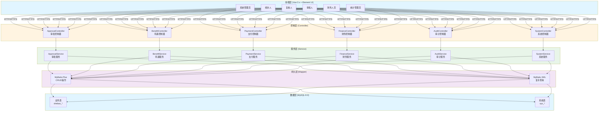

#### 3.1.2 技术栈说明

| 层级 | 技术/框架 | 版本 | 说明 |
|------|----------|------|------|
| **前端层** | Vue.js | 2.x | 渐进式JavaScript框架 |
| | Element UI | 2.x | 基于Vue的组件库 |
| | Axios | - | HTTP客户端 |
| | Vuex | - | 状态管理 |
| **控制层** | Spring MVC | 3.5.4 | Web框架 |
| | Spring Security | - | 安全框架 |
| **服务层** | Spring Boot | 3.5.4 | 应用框架 |
| | Spring AOP | - | 面向切面编程 |
| **持久层** | MyBatis-Plus | 3.5.6 | ORM框架 |
| | MyBatis | - | SQL映射框架 |
| **数据层** | MySQL | 8.0 | 关系型数据库 |
| | Redis | - | 缓存数据库 |

### 3.2 审批流程架构

采用**基于状态机的简化实现**(方案A):

#### 3.2.1 审批状态流转图

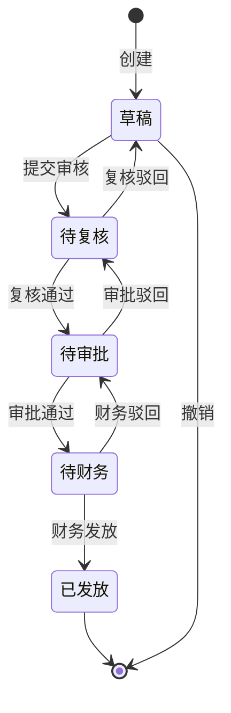

#### 3.2.2 不同业务类型的审批流程对比

| 业务类型 | 审批层级 | 状态流转 | 参与角色 |
|---------|---------|---------|---------|
| **人员登记** | 2级审核 | 草稿 → 待复核 → 已通过/已驳回 | 经办人 → 复核人 |
| **关键信息修改** | 3级审核 | 草稿 → 待复核 → 待审批 → 已通过/已驳回 | 经办人 → 复核人 → 审批人 |
| **待遇发放** | 3级审核 | 草稿 → 待复核 → 待审批 → 待财务 → 已发放 | 经办人 → 复核人 → 审批人 → 财务 |

#### 3.2.3 人员登记流程(2级审核)


#### 3.2.4 关键信息修改流程(3级审核)


#### 3.2.5 待遇发放流程(3级审核)


### 3.3 数据库架构设计原则

**最小化变更**(方案A):
- 在现有表基础上增加必要的审批字段
- 新增审批流程记录表和批次管理表
- 复用现有的del_flag、status等字段
- 保持表结构简单,便于快速实现

---

## 四、功能模块设计

### 4.1 功能模块清单

| 序号 | 模块名称 | 主要功能 | 复杂度 | 优先级 |
|------|----------|----------|--------|--------|
| 1 | 审批流程核心 | 状态机管理、审批服务 | 5 | P0 |
| 2 | 人员信息管理 | 5类人员登记、多级审核 | 6 | P0 |
| 3 | 待遇核定 | 到龄通知、单个/批量核定 | 6 | P0 |
| 4 | 待遇管理 | 发放信息修改、暂停/恢复、认证 | 5 | P1 |
| 5 | 待遇发放管理 | 支付结算、复核、审批(3级) | 5 | P0 |
| 6 | 财务管理 | 批次管理、失败处理、账户管理 | 5 | P1 |
| 7 | 审计查询和报表 | 日志查询、审批追溯、报表统计 | 4 | P1 |
| 8 | 前端菜单结构 | 6个角色菜单配置 | 4 | P1 |
| 9 | 被征地参保补贴（独立模块） | 被征地农民登记（含条件判断/自动计算）→申领（三方式）→支付计划（三类）→综合查询 | 7 | P0 |

### 4.2 核心业务流程

#### 4.2.1 人员登记流程(2级审核)

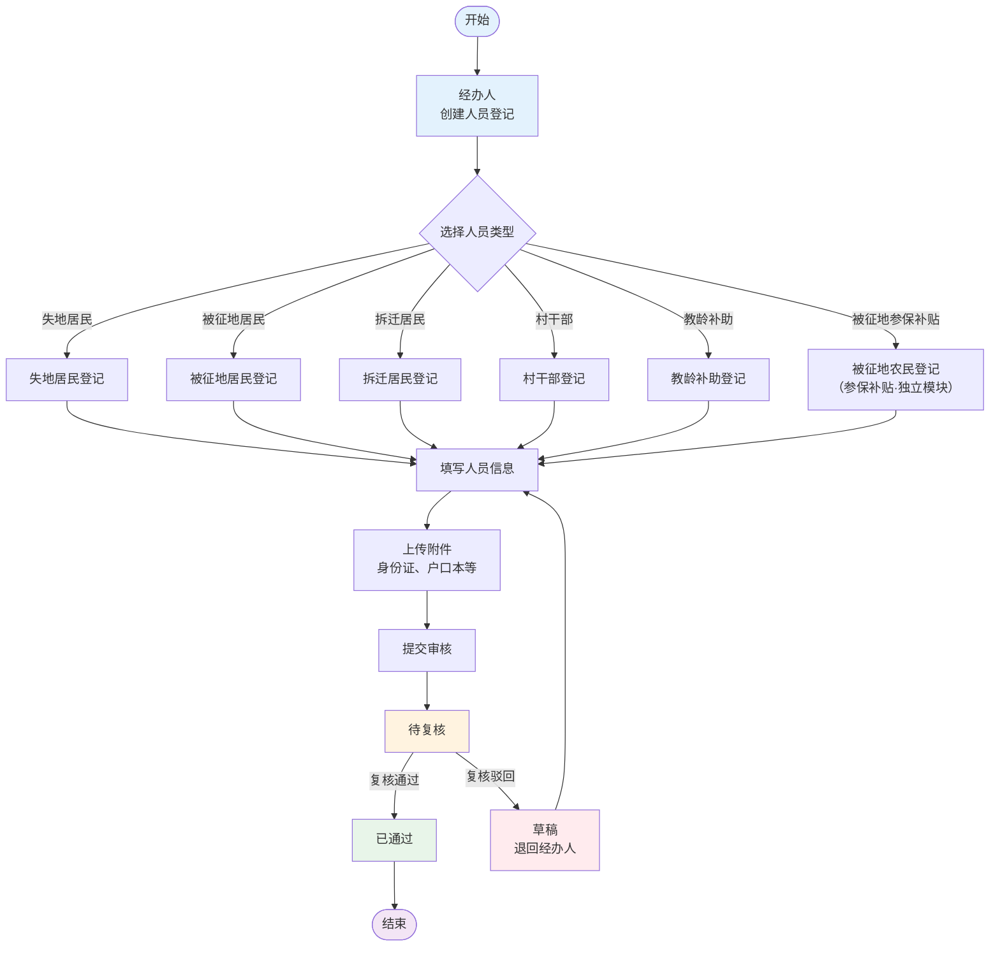

**支持人员类型**:
| 类型 | 说明 | 优先级 |
|------|------|--------|
| 失地居民 | 因征地失去土地的居民 | P0 |
| 被征地居民 | 被征用土地的居民 | P0 |
| 被征地参保补贴（独立） | 被征地农民参保补贴（登记含条件判断/自动计算，后续含申领/支付计划） | P0 |
| 拆迁居民 | 因拆迁需要安置的居民 | P0 |
| 村干部 | 村级干部补贴 | P0 |
| 教龄补助 | 教龄补助(原“教师补贴”) | P0 |

**人员登记批量导入**:
- 支持按人员类型下载 Excel 模板并导入数据（可选：更新已存在数据）
- 导入接口（已实现）:
  - 失地居民：`/shebao/landLossResident/importTemplate`、`/shebao/landLossResident/importData`
  - 被征地居民：`/shebao/expropriateeSubsidy/importTemplate`、`/shebao/expropriateeSubsidy/importData`
  - 拆迁居民：`/shebao/demolitionResident/importTemplate`、`/shebao/demolitionResident/importData`
  - 村干部：`/shebao/villageOfficial/importTemplate`、`/shebao/villageOfficial/importData`
  - 基础信息：`/shebao/subsidyPerson/importTemplate`、`/shebao/subsidyPerson/importData`

> 说明：**“被征地参保补贴（独立模块）”不复用上述被征地居民登记/导入接口**，其登记、申领、支付计划、综合查询需单独设计与实现（详见本文档 4.2.6 以及 `spec/被征地参保补贴重构设计.md`）。

#### 4.2.2 关键信息修改流程(3级审核)

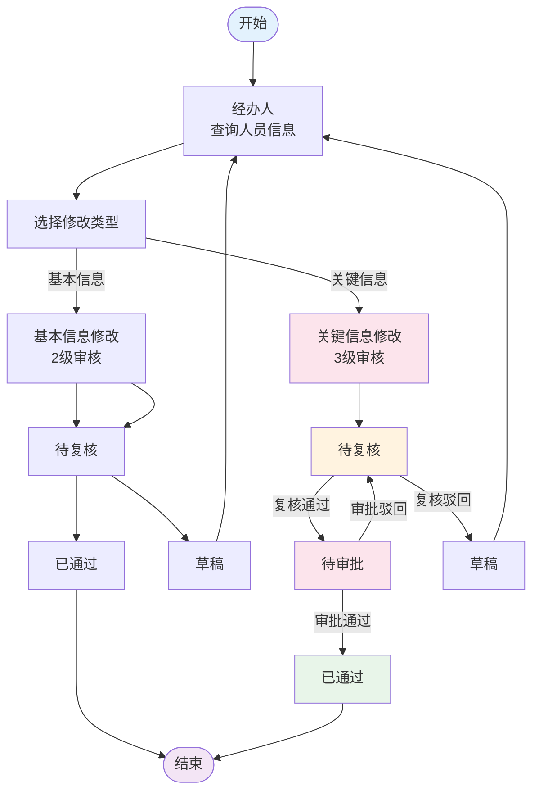

**关键信息**:
- 姓名
- 身份证号

**补充说明（基本信息修改）**:
- 村干部信息中的“累计任职年限（totalServiceYears）”支持在人员信息修改中调整（按对应流程进入复核/审批）

#### 4.2.3 待遇核定流程(2级审核)

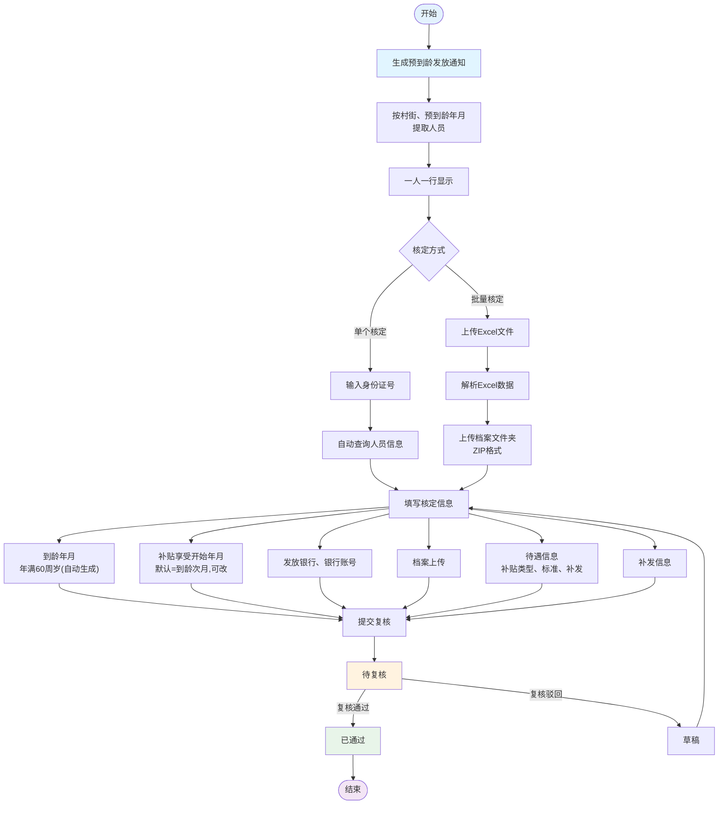

**核定内容清单**:
| 类别 | 具体内容 | 说明 |
|------|---------|------|
| **到龄信息** | 到龄年月 | 年满60周岁的年月 |
| **补贴信息** | 补贴享受开始年月 | 默认=到龄次月；若到龄次月早于征地/拆迁时间则取征地/拆迁时间；否则取到龄次月（可修改） |
| **银行信息** | 发放银行、银行账号 | 资金发放账户 |
| **档案信息** | 身份证、户口页 | 照片或扫描件 |
| **待遇信息** | 补贴类型、补贴标准、补发月数、补发金额 | 待遇明细 |
| **补发信息** | 补贴类型、应补发年月、应补发金额 | 补发明细 |

**核定表保存与打印**:
- 核定信息保存后,支持导出/打印《待遇核定表》用于线下业务办理归档

#### 4.2.4 待遇发放流程(3级审核)

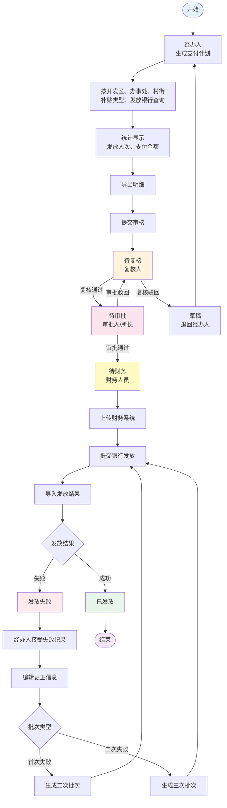

**流程特点**:
| 特点 | 说明 |
|------|------|
| **逐级退回** | 支持从任意节点退回到上一节点 |
| **失败重试** | 支持二次、三次发放(针对银行发放失败) |
| **可撤销** | 审批后可撤销(在下一环节前) |
| **统计展示** | 按补贴类型统计人数和金额 |

#### 4.2.5 失败处理流程(二次/三次发放)

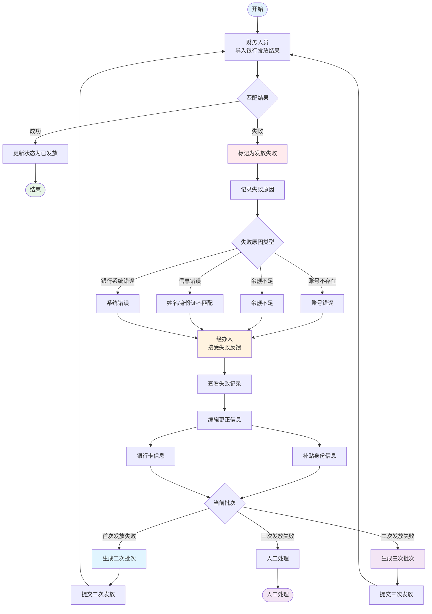

**失败原因分类**:
| 失败原因 | 说明 | 处理方式 |
|---------|------|---------|
| **账号不存在** | 银行账号无效 | 更正账号信息 |
| **余额不足** | 财务账户余额不足 | 充值后重试 |
| **信息错误** | 姓名、身份证号不匹配 | 更正人员信息 |
| **银行系统错误** | 银行系统异常 | 联系银行处理 |

#### 4.2.6 被征地参保补贴流程（独立模块）

> 说明：被征地参保补贴与现有“登记→待遇核定→支付发放”存在流程与数据模型差异，需**单独建模**。本文在概要层面给出流程骨架与关键约束；详细字段、表结构与流程细化见 `spec/被征地参保补贴重构设计.md`。

**流程总览**（登记→申领→支付计划→综合查询）：

```mermaid
flowchart LR
  A[被征地农民登记\n(含是否符合/是否申请/自动计算)] --> B[补贴申领]
  B --> B1[申领-职工]
  B --> B2[申领-城乡线下]
  B --> B3[申领-城乡系统(批量)]
  B1 & B2 & B3 --> C[支付计划生成\n(按三类分别生成)]
  C --> D[财务提交银行/导入结果]
  D --> E[综合查询\n(身份证号聚合：登记-申领-支付)]
```

**审批复用原则**：
- **登记**：2级审核（经办人→复核人），复用 `approval_status` 状态机（草稿/待复核/已通过/已驳回）。
- **申领/支付计划**：可按现有“待遇发放流程(3级审核)”复用（经办人→复核人→审批人→财务），但**按申领方式分三类口径统计与导出**。

**独立数据模型（建议）**：
- `land_acquisition_farmer`：被征地农民登记（含条件判断与自动计算结果）
- `land_acquisition_subsidy_claim`：补贴申领（claim_type=职工/城乡线下/城乡系统）
- `land_acquisition_payment_plan`：支付计划（payment_type=职工/城乡线下/城乡系统）
- `land_acquisition_payment_detail`：支付明细（对接银行导入结果、失败原因、重发）

**打印输出（必须）**：
- 职工申领单：《开发区被征地农民参加企业职工养老保险补贴申领表》
- 城乡线下申领单：《开发区被征地农民参加城乡居民养老保险补贴申领表》
- 城乡系统批量表：《开发区被征地参加城乡养老保险补贴批量录入系统表》

**关键校验口径（概要）**：
- 登记：`is_qualified=0` 必填“不符合原因”，并禁止进入申领；`is_qualified=1 && is_applied=0` 必填“未申请原因”；`is_qualified=1 && is_applied=1` 才允许提交复核。
- 申领：登记审核“已通过”且已申请；本次金额 ≤ 余额；申领方式需与登记选择的补贴方式一致（职工/城乡二选一）。
- 城乡系统批量：按（征地批次、村街、身份证号、基准日）筛“未申领名单”，批量保存需形成“批量申领单号”，用于打印与防重复。

**接口设计（建议）**（命名空间示例：`/shebao/landAcq/*`）：
| 模块 | 接口 | 说明 |
|------|------|------|
| 登记（农民） | `GET /shebao/landAcq/farmer/list` | 分页查询（批次/村街/身份证号/基准日等） |
|  | `GET /shebao/landAcq/farmer/{id}` | 详情 |
|  | `POST /shebao/landAcq/farmer` | 新增（保存草稿） |
|  | `PUT /shebao/landAcq/farmer` | 修改（草稿/驳回可改） |
|  | `POST /shebao/landAcq/farmer/{id}/submit` | 提交复核（2级审核） |
|  | `POST /shebao/landAcq/farmer/{id}/review` | 复核通过/驳回 |
| 申领 | `GET /shebao/landAcq/claim/list` | 分页查询（claim_type/批量单号/状态等） |
|  | `POST /shebao/landAcq/claim` | 单笔申领（职工/城乡线下） |
|  | `POST /shebao/landAcq/claim/batch` | 批量申领（城乡系统） |
|  | `POST /shebao/landAcq/claim/{id}/submit` | 提交复核 |
|  | `POST /shebao/landAcq/claim/{id}/review` | 复核通过/驳回 |
|  | `POST /shebao/landAcq/claim/{id}/approve` | 审批通过/驳回 |
|  | `POST /shebao/landAcq/claim/{id}/finance` | 财务审核通过/驳回 |
|  | `GET /shebao/landAcq/claim/print/{claimNo}` | 申领表打印/导出 |
| 支付计划 | `POST /shebao/landAcq/paymentPlan/generate` | 按三类生成支付计划（含统计与明细） |
|  | `GET /shebao/landAcq/paymentPlan/list` | 支付计划分页查询 |
|  | `POST /shebao/landAcq/paymentPlan/{id}/submit` | 提交复核 |
|  | `POST /shebao/landAcq/paymentPlan/{id}/review` | 复核通过/驳回 |
|  | `POST /shebao/landAcq/paymentPlan/{id}/approve` | 审批通过/驳回 |
|  | `POST /shebao/landAcq/paymentPlan/{id}/submitBank` | 财务提交银行/导出银行模板 |
|  | `POST /shebao/landAcq/paymentPlan/{id}/importResult` | 导入银行发放结果，更新明细成功/失败 |
|  | `POST /shebao/landAcq/paymentPlan/{id}/retry` | 失败重发（生成新批次） |
| 综合查询 | `GET /shebao/landAcq/query/byIdCard` | 按身份证号聚合：登记-申领-支付-失败原因-金额汇总 |

---

## 五、数据库设计

### 5.1 新增表结构

| 序号 | 表名 | 说明 | 用途 |
|------|------|------|------|
| 1 | `approval_log` | 审批流程记录表 | 记录所有审批操作历史 |
| 2 | `distribution_batch` | 发放批次表 | 管理发放批次信息 |
| 3 | `approval_role_config` | 审批角色配置表 | 配置不同业务的审批角色 |
| 4 | `finance_account` | 财务账户表 | 管理5个补贴对应的财务账号 |
| 5 | `benefit_determination` | 待遇核定表 | 记录待遇核定信息 |
| 6 | `land_acquisition_farmer` | 被征地农民登记表 | 被征地参保补贴登记（条件判断/自动计算） |
| 7 | `land_acquisition_subsidy_claim` | 被征地参保补贴申领表 | 三种申领方式的申领单据（含打印） |
| 8 | `land_acquisition_payment_plan` | 被征地参保补贴支付计划表 | 三类支付计划批次（统计/审批/提交银行） |
| 9 | `land_acquisition_payment_detail` | 被征地参保补贴支付明细表 | 银行导入结果匹配、失败原因与重发 |

#### 5.1.1 审批流程记录表 (approval_log)

```sql
CREATE TABLE approval_log (
    id BIGINT AUTO_INCREMENT PRIMARY KEY COMMENT '主键ID',
    business_type VARCHAR(50) NOT NULL COMMENT '业务类型(person_registration/info_modify/benefit_determination/payment_plan)',
    business_id BIGINT NOT NULL COMMENT '业务ID',
    current_status VARCHAR(20) COMMENT '当前状态',
    operation_type VARCHAR(20) NOT NULL COMMENT '操作类型(submit/review/approve/reject/distribute/submit_finance)',
    operator_id BIGINT COMMENT '操作人ID',
    operator_name VARCHAR(64) NOT NULL COMMENT '操作人姓名',
    operation_remark VARCHAR(500) COMMENT '操作说明',
    create_time DATETIME DEFAULT CURRENT_TIMESTAMP COMMENT '创建时间',
    INDEX idx_business (business_type, business_id),
    INDEX idx_operator (operator_id, create_time)
) ENGINE=InnoDB DEFAULT CHARSET=utf8mb4 COMMENT='审批流程记录表';
```

#### 5.1.2 发放批次表 (distribution_batch)

```sql
CREATE TABLE distribution_batch (
    id BIGINT AUTO_INCREMENT PRIMARY KEY COMMENT '主键ID',
    batch_no VARCHAR(50) NOT NULL UNIQUE COMMENT '批次号',
    subsidy_type CHAR(1) NOT NULL COMMENT '补贴类型(1失地 2被征地 3拆迁 4村干部 5教师)',
    batch_type TINYINT NOT NULL DEFAULT 1 COMMENT '批次类型(1首次 2二次 3三次)',
    total_count INT DEFAULT 0 COMMENT '总人数',
    total_amount DECIMAL(15,2) DEFAULT 0.00 COMMENT '总金额',
    status VARCHAR(20) DEFAULT 'draft' COMMENT '状态(draft/submitted/reviewed/approved/submitted_bank/distributed)',
    create_by VARCHAR(64) DEFAULT '' COMMENT '创建者',
    create_time DATETIME DEFAULT CURRENT_TIMESTAMP COMMENT '创建时间',
    INDEX idx_batch_no (batch_no),
    INDEX idx_subsidy_type (subsidy_type),
    INDEX idx_status (status)
) ENGINE=InnoDB DEFAULT CHARSET=utf8mb4 COMMENT='发放批次表';
```

#### 5.1.3 审批角色配置表 (approval_role_config)

```sql
CREATE TABLE approval_role_config (
    id BIGINT AUTO_INCREMENT PRIMARY KEY COMMENT '主键ID',
    business_type VARCHAR(50) NOT NULL COMMENT '业务类型',
    approval_level TINYINT NOT NULL COMMENT '审批层级(1经办 2复核 3审批 4财务)',
    role_id BIGINT COMMENT '角色ID',
    is_required CHAR(1) DEFAULT '1' COMMENT '是否必填(0否 1是)',
    sort_order INT DEFAULT 0 COMMENT '排序',
    INDEX idx_business_level (business_type, approval_level)
) ENGINE=InnoDB DEFAULT CHARSET=utf8mb4 COMMENT='审批角色配置表';
```

#### 5.1.4 财务账户表 (finance_account)

```sql
CREATE TABLE finance_account (
    id BIGINT AUTO_INCREMENT PRIMARY KEY COMMENT '主键ID',
    subsidy_type CHAR(1) NOT NULL COMMENT '补贴类型(1失地 2被征地 3拆迁 4村干部 5教师)',
    account_name VARCHAR(100) NOT NULL COMMENT '账号名称',
    bank_name VARCHAR(100) COMMENT '银行名称',
    account_number VARCHAR(50) COMMENT '账号号码',
    balance DECIMAL(15,2) DEFAULT 0.00 COMMENT '账户余额',
    status CHAR(1) DEFAULT '0' COMMENT '状态(0正常 1停用)',
    create_by VARCHAR(64) DEFAULT '' COMMENT '创建者',
    create_time DATETIME DEFAULT CURRENT_TIMESTAMP COMMENT '创建时间',
    UNIQUE KEY uk_subsidy_type (subsidy_type)
) ENGINE=InnoDB DEFAULT CHARSET=utf8mb4 COMMENT='财务账户表';
```

#### 5.1.5 待遇核定表 (benefit_determination)

```sql
CREATE TABLE benefit_determination (
    id BIGINT AUTO_INCREMENT PRIMARY KEY COMMENT '主键ID',
    subsidy_person_id BIGINT NOT NULL COMMENT '被补贴人ID',
    subsidy_type CHAR(1) NOT NULL COMMENT '补贴类型',
    eligible_month DATE COMMENT '到龄年月',
    benefit_start_month DATE COMMENT '补贴享受开始年月',
    bank_id BIGINT COMMENT '发放银行ID',
    bank_account VARCHAR(50) COMMENT '银行账号',
    subsidy_standard DECIMAL(10,2) COMMENT '补贴标准',
    benefit_months INT COMMENT '补发月数',
    benefit_amount DECIMAL(10,2) COMMENT '补发金额',
    supplement_type CHAR(1) COMMENT '补发类型(1应补发年月 2应补发金额)',
    supplement_start_month DATE COMMENT '补发开始年月',
    supplement_end_month DATE COMMENT '补发终止年月',
    supplement_amount DECIMAL(10,2) COMMENT '补发金额',
    approval_status VARCHAR(20) DEFAULT 'draft' COMMENT '审批状态',
    submit_by VARCHAR(64) COMMENT '提交人',
    submit_time DATETIME COMMENT '提交时间',
    review_by VARCHAR(64) COMMENT '复核人',
    review_time DATETIME COMMENT '复核时间',
    approve_by VARCHAR(64) COMMENT '审批人',
    approve_time DATETIME COMMENT '审批时间',
    reject_reason VARCHAR(500) COMMENT '驳回原因',
    create_by VARCHAR(64) DEFAULT '' COMMENT '创建者',
    create_time DATETIME DEFAULT CURRENT_TIMESTAMP COMMENT '创建时间',
    FOREIGN KEY (subsidy_person_id) REFERENCES shebao_subsidy_person(id),
    INDEX idx_person_id (subsidy_person_id),
    INDEX idx_subsidy_type (subsidy_type),
    INDEX idx_approval_status (approval_status)
) ENGINE=InnoDB DEFAULT CHARSET=utf8mb4 COMMENT='待遇核定表';
```

### 5.2 修改现有表结构

#### 5.2.1 修改补贴发放记录表 (shebao_subsidy_distribution)

```sql
ALTER TABLE shebao_subsidy_distribution
  ADD COLUMN batch_no VARCHAR(50) COMMENT '批次号' AFTER id,
  ADD COLUMN approval_status VARCHAR(20) DEFAULT 'draft' COMMENT '审批状态(draft/pending_review/pending_approve/pending_finance/distributed/rejected)',
  ADD COLUMN rejection_reason VARCHAR(500) COMMENT '驳回原因',
  ADD COLUMN rejection_level TINYINT COMMENT '驳回层级(1经办驳回 2复核驳回 3审批驳回)',
  ADD INDEX idx_batch_no (batch_no),
  ADD INDEX idx_approval_status (approval_status);
```

#### 5.2.2 修改被补贴人信息表 (shebao_subsidy_person)

```sql
ALTER TABLE shebao_subsidy_person
  ADD COLUMN certification_status VARCHAR(20) DEFAULT 'uncertified' COMMENT '认证状态(uncertified/certified_april/certified_october)',
  ADD COLUMN last_certification_date DATE COMMENT '最后认证日期',
  ADD COLUMN suspension_status VARCHAR(20) DEFAULT 'normal' COMMENT '暂停状态(normal/suspended)',
  ADD COLUMN suspension_start_date DATE COMMENT '暂停开始年月',
  ADD COLUMN suspension_reason VARCHAR(100) COMMENT '暂停原因',
  ADD COLUMN suspension_end_date DATE COMMENT '暂停结束年月',
  ADD INDEX idx_certification_status (certification_status),
  ADD INDEX idx_suspension_status (suspension_status);
```

### 5.3 数据字典设计

| 字典类型 | 字典编码 | 字典名称 | 字典值说明 |
|----------|----------|----------|------------|
| subsidy_type | 1 | 失地居民补贴 | 失地居民 |
| subsidy_type | 2 | 被征地居民补贴 | 被征地居民 |
| subsidy_type | 3 | 拆迁居民补贴 | 拆迁居民 |
| subsidy_type | 4 | 村干部补贴 | 村干部 |
| subsidy_type | 5 | 教龄补助 | 教龄补助(原“教师补贴”) |
| land_acquisition_claim_type | 1 | 职工 | 被征地参保补贴申领方式：职工 |
| land_acquisition_claim_type | 2 | 城乡线下 | 被征地参保补贴申领方式：城乡线下 |
| land_acquisition_claim_type | 3 | 城乡系统 | 被征地参保补贴申领方式：城乡系统（批量） |
| land_acquisition_subsidy_method | 1 | 参加城乡居保 | 被征地参保补贴方式（二选一） |
| land_acquisition_subsidy_method | 2 | 参加职工养老 | 被征地参保补贴方式（二选一） |
| land_acquisition_payment_type | 1 | 职工 | 被征地参保补贴支付计划分类：职工 |
| land_acquisition_payment_type | 2 | 城乡线下 | 被征地参保补贴支付计划分类：城乡线下 |
| land_acquisition_payment_type | 3 | 城乡系统 | 被征地参保补贴支付计划分类：城乡系统 |
| approval_status | draft | 草稿 | 草稿 |
| approval_status | pending_review | 待复核 | 待复核 |
| approval_status | pending_approve | 待审批 | 待审批 |
| approval_status | pending_finance | 待财务 | 待财务 |
| approval_status | distributed | 已发放 | 已发放 |
| approval_status | rejected | 已驳回 | 已驳回 |
| batch_type | 1 | 首次发放 | 首次发放 |
| batch_type | 2 | 二次发放 | 二次发放 |
| batch_type | 3 | 三次发放 | 三次发放 |
| suspension_reason | death | 死亡 | 死亡 |
| suspension_reason | uncertified | 未认证 | 未认证 |
| suspension_reason | imprisonment | 服刑 | 服刑 |
| suspension_reason | missing | 失踪 | 失踪 |
| suspension_reason | other | 其他 | 其他 |
| recovery_reason | certified | 已认证 | 已认证 |
| recovery_reason | imprisonment_finished | 服刑完毕 | 服刑完毕 |
| recovery_reason | other | 其他 | 其他 |
| cert_status | unverified | 未认证 | 未认证 |
| cert_status | verified_april | 已认证4月 | 已认证4月 |
| cert_status | verified_october | 已认证10月 | 已认证10月 |

> 说明：被征地参保补贴采用**独立模块**建模，不以 `subsidy_type` 扩展编码（避免与现有补贴统一发放模型强耦合）；其业务分类使用 `land_acquisition_claim_type/land_acquisition_payment_type` 等字典。

---

## 六、菜单结构设计

### 6.1 系统管理员菜单

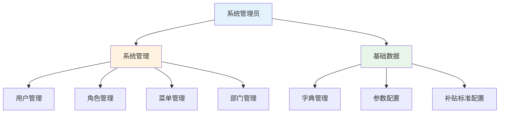

| 菜单模块 | 子菜单 | 权限标识 | 说明 |
|---------|--------|---------|------|
| **系统管理** | 用户管理 | `system:user:list` | 管理系统用户 |
| | 角色管理 | `system:role:list` | 管理角色权限 |
| | 菜单管理 | `system:menu:list` | 管理菜单结构 |
| | 部门管理 | `system:dept:list` | 管理部门组织 |
| **基础数据** | 字典管理 | `system:dict:list` | 管理数据字典 |
| | 参数配置 | `system:config:list` | 管理系统参数 |
| | 补贴标准配置 | `shebao:standard:list` | 配置补贴标准 |

### 6.2 经办人菜单

```mermaid
graph TD
    A[经办人] --> B[人员信息管理]
    A --> C[待遇核定]
    A --> D[待遇管理]
    A --> E[支付结算]

    B --> B1[失地居民登记]
    B --> B2[被征地居民登记]
    B --> B8[被征地农民登记\n(参保补贴·独立)]
    B --> B3[拆迁居民登记]
    B --> B4[村干部登记]
    B --> B5[教龄补助登记]
    B --> B6[基本信息修改]
    B --> B7[关键信息修改]

    C --> C1[预到龄发放通知]
    C --> C2[待遇核定]

    D --> D1[发放信息修改]
    D --> D2[待遇暂停]
    D --> D3[待遇恢复]
    D --> D4[待遇认证]

    E --> E1[生成支付计划]
    E --> E2[支付计划复核]
    E --> E3[支付计划审批]
    E --> E4[被征地参保补贴申领-职工]
    E --> E5[被征地参保补贴申领-城乡线下]
    E --> E6[被征地参保补贴申领-城乡系统(批量)]
    E --> E7[被征地参保补贴支付计划(三类)]

    style A fill:#e3f2fd
    style B fill:#e1f5ff
    style C fill:#fff3e0
    style D fill:#e8f5e9
    style E fill:#f3e5f5
```

| 菜单模块 | 子菜单 | 权限标识 | 说明 |
|---------|--------|---------|------|
| **人员信息管理** | 失地居民登记 | `shebao:person:landloss:*` | 失地居民信息登记 |
| | 被征地居民登记 | `shebao:person:expropriatee:*` | 被征地居民信息登记 |
| | 被征地农民登记（参保补贴·独立） | `shebao:landAcq:farmer:*` | 被征地参保补贴登记（含条件判断/自动计算） |
| | 拆迁居民登记 | `shebao:person:demolition:*` | 拆迁居民信息登记 |
| | 村干部登记 | `shebao:person:village:*` | 村干部信息登记 |
| | 教龄补助登记 | `shebao:person:teacher:*` | 教龄补助信息登记(原“教师补贴”) |
| | 基本信息修改 | `shebao:person:modify:basic:*` | 修改基本信息(2级审核) |
| | 关键信息修改 | `shebao:person:modify:key:*` | 修改关键信息(3级审核) |
| **待遇核定** | 预到龄发放通知 | `shebao:benefit:notice:*` | 生成到龄通知 |
| | 待遇核定 | `shebao:benefit:determination:*` | 单个/批量核定 |
| **待遇管理** | 发放信息修改 | `shebao:benefit:modify:*` | 修改发放信息 |
| | 待遇暂停 | `shebao:benefit:suspend:*` | 暂停待遇发放 |
| | 待遇恢复 | `shebao:benefit:recover:*` | 恢复待遇发放 |
| | 待遇认证 | `shebao:benefit:certification:*` | 4月/10月认证 |
| **支付结算** | 生成支付计划 | `shebao:payment:settlement:*` | 生成支付计划 |
| | 支付计划复核 | `shebao:payment:review:*` | 复核支付计划(业务菜单) |
| | 支付计划审批 | `shebao:payment:approve:*` | 审批支付计划(业务菜单) |
| **支付结算（参保补贴·独立）** | 被征地参保补贴申领（职工） | `shebao:landAcq:claim:employee:*` | 单笔申领，生成《职工养老保险补贴申领表》并可打印 |
| | 被征地参保补贴申领（城乡线下） | `shebao:landAcq:claim:urbanOffline:*` | 单笔申领，生成《城乡居民养老保险补贴申领表》并可打印 |
| | 被征地参保补贴申领（城乡系统） | `shebao:landAcq:claim:urbanSystem:*` | 批量勾选未申领名单，生成《批量录入系统表》并可打印 |
| | 被征地参保补贴支付计划（三类） | `shebao:landAcq:paymentPlan:*` | 按三类生成支付计划并提交审核 |
| **人员信息管理** | 人员注销登记 | `shebao:subsidyPerson:cancel` | 按身份证号登记死亡,标记死亡状态 |

### 6.3 财务人员菜单

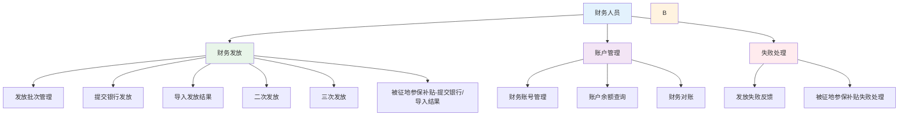

| 菜单模块 | 子菜单 | 权限标识 | 说明 |
|---------|--------|---------|------|
| **财务发放** | 发放批次管理 | `shebao:finance:batch:*` | 管理发放批次 |
| | 提交银行发放 | `shebao:finance:submit:*` | 提交银行发放 |
| | 导入发放结果 | `shebao:finance:import:*` | 导入银行结果 |
| | 二次发放 | `shebao:finance:retry:second:*` | 二次发放处理 |
| | 三次发放 | `shebao:finance:retry:third:*` | 三次发放处理 |
| **财务发放（参保补贴·独立）** | 被征地参保补贴-提交银行/导入结果 | `shebao:landAcq:finance:distribute:*` | 对支付计划进行提交银行、导入结果、更新明细状态 |
| **账户管理** | 财务账号管理 | `shebao:finance:account:*` | 管理财务账号 |
| | 账户余额查询 | `shebao:finance:balance:*` | 查询账户余额 |
| | 财务对账 | `shebao:finance:reconcile:*` | 财务对账功能 |
| **失败处理** | 发放失败反馈 | `shebao:finance:fail:*` | 处理失败记录 |
| **失败处理（参保补贴·独立）** | 被征地参保补贴失败处理 | `shebao:landAcq:finance:fail:*` | 查看失败明细、发起重发批次或退回业务更正 |

### 6.4 统计管理员菜单

```mermaid
graph TD
    A[统计管理员] --> B[经办查询]
    A --> C[报表统计]
    A --> D[综合查询]

    B --> B1[操作日志]
    B --> B2[登录日志]
    B --> B3[业务办理进度]
    B --> B4[审批记录追溯]
    B --> B5[修改历史追溯(不可下放)]

    C --> C1[人员注销明细表]
    C --> C2[待遇暂停人员明细表]
    C --> C3[年度新增待遇享受人员明细表]
    C --> C4[登记人员明细表]
    C --> C5[发放明细表/汇总表]

    D --> D1[人员信息综合查询(身份证号)]
    D --> D2[被征地参保补贴综合查询]

    style A fill:#e3f2fd
    style B fill:#e1f5ff
    style C fill:#fff3e0
```

| 菜单模块 | 子菜单 | 权限标识 | 说明 |
|---------|--------|---------|------|
| **经办查询** | 操作日志 | `audit:log:operation:*` | 查询操作日志 |
| | 登录日志 | `audit:log:login:*` | 查询登录日志 |
| | 业务办理进度 | `audit:progress:*` | 业务办理进度查询 |
| | 审批记录追溯 | `audit:log:approval:*` | 追溯审批记录 |
| | 修改历史追溯(不可下放) | `audit:log:modify:*` | 追溯修改历史(仅统计管理员) |
| **报表统计** | 人员注销明细表 | `audit:report:cancel:*` | 人员注销明细 |
| | 待遇暂停人员明细表 | `audit:report:suspend:*` | 待遇暂停明细 |
| | 年度新增待遇享受人员明细表 | `audit:report:annual_new:*` | 年度新增明细 |
| | 登记人员明细表 | `audit:report:registration:*` | 登记明细 |
| | 发放明细表/汇总表 | `audit:report:distribution:*` | 发放相关报表 |
| **综合查询** | 人员信息综合查询 | `audit:query:resident:*` | 按身份证号聚合查询 |
| | 被征地参保补贴综合查询 | `audit:query:landAcq:*` | 按身份证号聚合：登记/申领/支付/失败原因/金额汇总 |

---

## 七、技术实现要点

### 7.1 审批流程实现

#### 7.1.1 状态机管理

```java
// 审批状态枚举
public enum ApprovalStatus {
    DRAFT("draft", "草稿"),
    PENDING_REVIEW("pending_review", "待复核"),
    PENDING_APPROVE("pending_approve", "待审批"),
    PENDING_FINANCE("pending_finance", "待财务"),
    DISTRIBUTED("distributed", "已发放"),
    REJECTED("rejected", "已驳回")
}

// 状态流转方法
public boolean canTransition(ApprovalStatus current, ApprovalStatus target, String operation) {
    // 草稿 → 待复核
    if (current == DRAFT && target == PENDING_REVIEW && "submit".equals(operation)) {
        return true;
    }
    // 待复核 → 待审批
    if (current == PENDING_REVIEW && target == PENDING_APPROVE && "review".equals(operation)) {
        return true;
    }
    // 待复核 → 草稿
    if (current == PENDING_REVIEW && target == DRAFT && "reject".equals(operation)) {
        return true;
    }
    // ... 其他状态流转规则
    return false;
}
```

#### 7.1.2 审批服务示例

```java
@Service
public class ApprovalService {

    @Transactional
    public void submitForReview(Long businessId, String businessType) {
        // 1. 查询业务记录
        Object business = getBusinessRecord(businessId, businessType);

        // 2. 检查状态
        validateStatus(business);

        // 3. 更新状态为待复核
        updateStatus(businessId, businessType, ApprovalStatus.PENDING_REVIEW);

        // 4. 记录审批日志
        ApprovalLog log = new ApprovalLog();
        log.setBusinessType(businessType);
        log.setBusinessId(businessId);
        log.setCurrentStatus(ApprovalStatus.PENDING_REVIEW.getCode());
        log.setOperationType("submit");
        log.setOperatorId(SecurityUtils.getUserId());
        log.setOperatorName(SecurityUtils.getUsername());
        approvalLogMapper.insert(log);
    }

    @Transactional
    public void review(Long businessId, String businessType, boolean approved, String remark) {
        // 1. 查询业务记录
        Object business = getBusinessRecord(businessId, businessType);

        // 2. 检查状态
        if (business.getApprovalStatus() != ApprovalStatus.PENDING_REVIEW) {
            throw new ServiceException("当前状态不支持复核操作");
        }

        // 3. 更新状态
        ApprovalStatus newStatus = approved ?
            ApprovalStatus.PENDING_APPROVE :
            ApprovalStatus.DRAFT;
        updateStatus(businessId, businessType, newStatus, remark);

        // 4. 记录审批日志
        ApprovalLog log = new ApprovalLog();
        log.setBusinessType(businessType);
        log.setBusinessId(businessId);
        log.setCurrentStatus(newStatus.getCode());
        log.setOperationType(approved ? "review" : "reject");
        log.setOperationRemark(remark);
        log.setOperatorId(SecurityUtils.getUserId());
        log.setOperatorName(SecurityUtils.getUsername());
        approvalLogMapper.insert(log);
    }

    // ... 其他审批方法
}
```

### 7.2 文件上传实现

```java
@RestController
@RequestMapping("/benefit")
public class BenefitController {

    @PostMapping("/uploadFiles")
    public AjaxResult uploadFiles(@RequestParam("files") MultipartFile[] files,
                                   @RequestParam("idCardNo") String idCardNo) {
        // 1. 校验身份证号
        validateIdCardNo(idCardNo);

        // 2. 创建存储目录
        String uploadPath = createUploadPath(idCardNo);

        // 3. 保存文件
        List<String> filePaths = new ArrayList<>();
        for (MultipartFile file : files) {
            String filePath = FileUploadUtils.upload(uploadPath, file);
            filePaths.add(filePath);
        }

        // 4. 返回文件路径
        return AjaxResult.success(filePaths);
    }

    @PostMapping("/uploadZip")
    public AjaxResult uploadZip(@RequestParam("file") MultipartFile file,
                                @RequestParam("idCardNo") String idCardNo) {
        // 1. 校验身份证号
        validateIdCardNo(idCardNo);

        // 2. 保存zip文件
        String uploadPath = createUploadPath(idCardNo);
        String zipFilePath = FileUploadUtils.upload(uploadPath, file);

        // 3. 解压zip文件
        List<String> extractedFiles = ZipUtils.extract(zipFilePath, uploadPath);

        // 4. 按文件命名规范解析
        List<FileRecord> fileRecords = parseFileName(extractedFiles);

        // 5. 保存文件记录到数据库
        saveFileRecords(idCardNo, fileRecords);

        return AjaxResult.success();
    }
}
```

### 7.3 批量导入实现

```java
@Service
public class BenefitDeterminationService {

    @Transactional
    public AjaxResult batchDetermination(MultipartFile file) {
        try {
            // 1. 读取Excel文件
            List<BenefitDeterminationExcel> excelList = ExcelUtils.importExcel(file, BenefitDeterminationExcel.class);

            // 2. 数据校验
            validateExcelList(excelList);

            // 3. 批量插入数据
            List<BenefitDetermination> benefitList = new ArrayList<>();
            for (BenefitDeterminationExcel excel : excelList) {
                BenefitDetermination benefit = convertToEntity(excel);
                benefitList.add(benefit);
            }
            benefitDeterminationMapper.insertBatch(benefitList);

            // 4. 提交审核(可选)
            submitForReview(benefit.getId(), "benefit_determination");

            return AjaxResult.success("成功导入" + benefitList.size() + "条数据");
        } catch (Exception e) {
            throw new ServiceException("批量导入失败: " + e.getMessage());
        }
    }
}
```

### 7.4 权限控制实现

```java
@RestController
@RequestMapping("/approval")
public class ApprovalController extends BaseController {

    @PreAuthorize("@ss.hasPermi('shebao:approval:review')")
    @PostMapping("/review")
    public AjaxResult review(@RequestBody Map<String, Object> params) {
        Long businessId = Long.parseLong(params.get("businessId").toString());
        String businessType = params.get("businessType").toString();
        boolean approved = Boolean.parseBoolean(params.get("approved").toString());
        String remark = (String) params.get("remark");

        approvalService.review(businessId, businessType, approved, remark);
        return toAjax(true);
    }

    @PreAuthorize("@ss.hasPermi('shebao:approval:approve')")
    @PostMapping("/approve")
    public AjaxResult approve(@RequestBody Map<String, Object> params) {
        Long businessId = Long.parseLong(params.get("businessId").toString());
        String businessType = params.get("businessType").toString();
        boolean approved = Boolean.parseBoolean(params.get("approved").toString());
        String remark = (String) params.get("remark");

        approvalService.approve(businessId, businessType, approved, remark);
        return toAjax(true);
    }
}
```

---

## 八、前端设计要点

### 8.1 审批状态显示

```vue
<template>
  <el-tag :type="getStatusType(distribution.approvalStatus)">
    {{ getStatusText(distribution.approvalStatus) }}
  </el-tag>
</template>

<script>
export default {
  methods: {
    getStatusType(status) {
      const typeMap = {
        'draft': 'info',
        'pending_review': 'warning',
        'pending_approve': 'primary',
        'pending_finance': 'success',
        'distributed': '',
        'rejected': 'danger'
      }
      return typeMap[status] || 'info'
    },
    getStatusText(status) {
      const textMap = {
        'draft': '草稿',
        'pending_review': '待复核',
        'pending_approve': '待审批',
        'pending_finance': '待财务',
        'distributed': '已发放',
        'rejected': '已驳回'
      }
      return textMap[status] || status
    }
  }
}
</script>
```

### 8.2 审批历史时间轴

```vue
<template>
  <el-timeline>
    <el-timeline-item
      v-for="log in approvalHistory"
      :key="log.id"
      :timestamp="log.createTime"
      placement="top">
      <el-card>
        <h4>{{ getOperationText(log.operationType) }}</h4>
        <p>操作人: {{ log.operatorName }}</p>
        <p v-if="log.operationRemark">备注: {{ log.operationRemark }}</p>
      </el-card>
    </el-timeline-item>
  </el-timeline>
</template>
```

### 8.3 权限按钮控制

```vue
<template>
  <el-button
    v-if="distribution.approvalStatus === 'pending_review' && hasPermi('shebao:approval:review')"
    type="primary"
    size="small"
    @click="handleReview(distribution)"
  >
    复核
  </el-button>

  <el-button
    v-if="distribution.approvalStatus === 'pending_approve' && hasPermi('shebao:approval:approve')"
    type="success"
    size="small"
    @click="handleApprove(distribution)"
  >
    审批
  </el-button>
</template>
```

---

## 九、实施计划

### 9.1 阶段划分

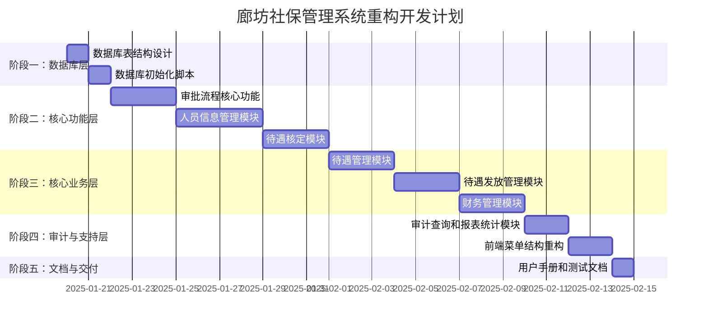

| 阶段 | 任务 | 复杂度 | 预计时间 | 交付物 |
|------|------|--------|----------|--------|
| **阶段一** | 数据库表结构设计 | 3/10 | 1天 | 建表SQL |
| | 数据库初始化脚本 | 4/10 | 1天 | 初始化脚本 |
| **阶段二** | 审批流程核心功能 | 5/10 | 3天 | Service、Controller |
| | 人员信息管理模块 | 6/10 | 4天 | 完整CRUD+审核 |
| | 待遇核定模块 | 6/10 | 3天 | Service、Controller |
| **阶段三** | 待遇管理模块 | 5/10 | 3天 | Service、Controller |
| | 待遇发放管理模块 | 5/10 | 3天 | Service、Controller |
| | 财务管理模块 | 5/10 | 3天 | Service、Controller |
| **阶段四** | 审计查询和报表统计模块 | 4/10 | 2天 | Service、Controller |
| | 前端菜单结构重构 | 4/10 | 2天 | 路由配置、菜单数据 |
| **阶段五** | 用户手册和测试文档 | 2/10 | 1天 | 文档、测试用例 |

**总计**: 约 **26个工作日** (约 **5-6周**)

### 9.2 里程碑

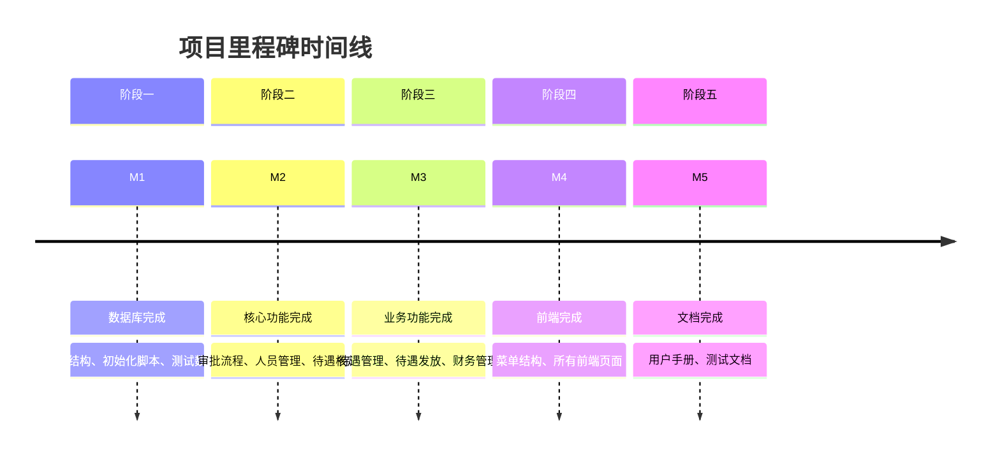

| 里程碑 | 日期 | 交付内容 | 验收标准 |
|--------|------|----------|----------|
| **M1: 数据库完成** | Day 2 | 表结构、初始化脚本、测试数据 | 所有表创建成功，数据可正常查询 |
| **M2: 核心功能完成** | Day 11 | 审批流程、人员管理、待遇核定 | 核心业务流程可走通 |
| **M3: 业务功能完成** | Day 20 | 待遇管理、待遇发放、财务管理 | 所有业务功能可用 |
| **M4: 前端完成** | Day 22 | 菜单结构、所有前端页面 | 6个角色可分别登录并看到相应菜单 |
| **M5: 文档完成** | Day 23 | 用户手册、测试文档 | 文档完整，测试用例通过 |

---

## 十、预期成果

### 10.1 可演示的功能

1. **多角色登录**: 6个角色可分别登录,看到不同的菜单
2. **人员登记流程**: 5类人员登记,2级审核流程
3. **待遇核定流程**: 到龄通知生成、单个/批量核定
4. **待遇管理流程**: 发放信息修改、暂停/恢复、认证
5. **待遇发放流程**: 3级审核(经办人→复核人→审批人→财务)
6. **失败处理流程**: 二次、三次发放
7. **财务管理**: 批次管理、账户管理、失败处理
8. **统计报表**: 操作日志、审批追溯、统计报表

### 10.2 交付物清单

1. **数据库脚本**:
   - 表结构变更SQL
   - 初始化数据SQL
   - 测试数据SQL

2. **后端代码**:
   - 实体类(Entity)
   - Mapper接口和XML
   - Service服务类
   - Controller控制器类

3. **前端代码**:
   - Vue页面组件
   - 路由配置
   - API接口定义

4. **文档**:
   - 用户操作手册
   - 测试验证文档
   - 演示脚本

### 10.3 演示环境

- **数据库**: MySQL 8.0 + 测试数据
- **后端**: Spring Boot 3.5.4 + Java 17
- **前端**: Vue 2.x + Element UI
- **访问地址**:
  - 前端: http://localhost:80
  - 后端: http://localhost:8087/api
- **测试账号**:
  - 经办人: operator01 / admin123
  - 复核人: reviewer01 / admin123
  - 审批人: approver01 / admin123
  - 财务人员: finance01 / admin123
  - 统计管理员: statistics01 / admin123
  - 系统管理员: admin / admin123

---

## 十一、风险与应对

### 11.1 需求理解偏差

**风险**: 用户需求可能在实现过程中调整
**应对**:
- 快速出原型,及时与用户沟通调整
- 采用状态机,便于后续流程变更
- 最小化数据库改动,降低重构成本

### 11.2 数据迁移复杂

**风险**: 现有数据迁移到新结构
**应对**:
- 先使用mock数据,用户确认后再考虑迁移
- 提供数据迁移工具或脚本
- 做好数据备份,确保数据安全

### 11.3 审批流程变更

**风险**: 审批流程可能需要调整
**应对**:
- 采用状态机,便于后续调整
- 审批角色配置化,灵活配置节点
- 保留完整的审批历史记录

### 11.4 性能问题

**风险**: 大数据量报表查询性能
**应对**:
- 使用分页加载
- 建立合适的索引
- 考虑使用Redis缓存热点数据
- 大量数据导出使用异步处理

### 11.5 兼容性问题

**风险**: 与现有框架和代码的兼容性
**应对**:
- 保持现有框架和代码结构
- 最小化改动,复用现有组件
- 使用Spring Boot和MyBatis-Plus的兼容版本
- 做好代码review和测试

---

## 十二、后续优化方向

### 12.1 功能增强

1. **消息通知**: 审批通过/驳回时发送短信或邮件通知
2. **电子签章**: 支持电子签章功能
3. **手机APP**: 开发移动端APP,方便移动办公
4. **大数据分析**: 使用大数据技术进行趋势分析
5. **AI辅助**: 使用AI进行数据校验和风险预警

### 12.2 性能优化

1. **缓存优化**: 引入Redis缓存热点数据
2. **数据库优化**: 分库分表,提升查询性能
3. **前端优化**: 虚拟滚动,懒加载
4. **CDN加速**: 静态资源使用CDN加速

### 12.3 架构优化

1. **微服务改造**: 考虑将单体应用改造为微服务架构
2. **容器化部署**: 使用Docker容器化部署
3. **CI/CD**: 建立持续集成和持续部署流程
4. **监控告警**: 引入监控和告警系统

---

## 附录

### A. 术语表

| 术语 | 说明 |
|------|------|
| 经办人 | 业务人员,负责数据录入和提交审核 |
| 复核人 | 业务人员,负责复核经办人提交的数据 |
| 审批人 | 业务负责人(所长),负责最终审批 |
| 复核人 | 财务人员,负责审核经办人提交的数据 |
| 审批人 | 财务负责人(所长),负责最终审批 |
| 财务 | 财务人员,负责资金发放 |
| 待遇核定 | 对到龄人员进行补贴资格核定的过程 |
| 待遇暂停 | 暂停补贴发放的操作 |
| 待遇恢复 | 恢复补贴发放的操作 |
| 待遇认证 | 每年两次(4月、10月)的资格认证 |
| 批次 | 一次性发放的记录集合 |
| 追回 | 因错误发放需要追回的资金 |

### B. 参考资料

1. 若依框架官方文档
2. Spring Boot官方文档
3. MyBatis-Plus官方文档
4. Vue.js官方文档
5. Element UI官方文档

---

**文档结束**

本文档为廊坊社保管理系统重构设计的概要文档,涵盖了系统架构、功能设计、数据库设计、技术实现要点和实施计划。如有疑问或需要进一步讨论,请随时联系。
