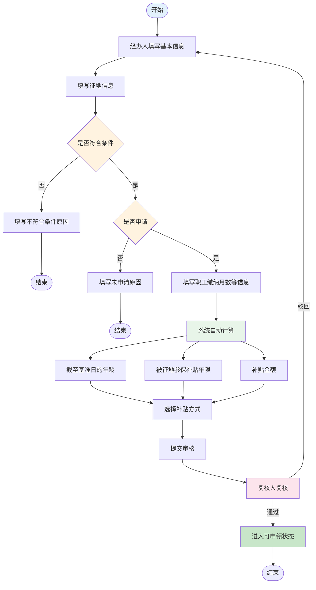
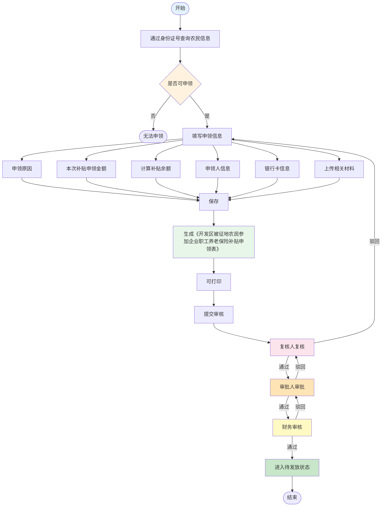
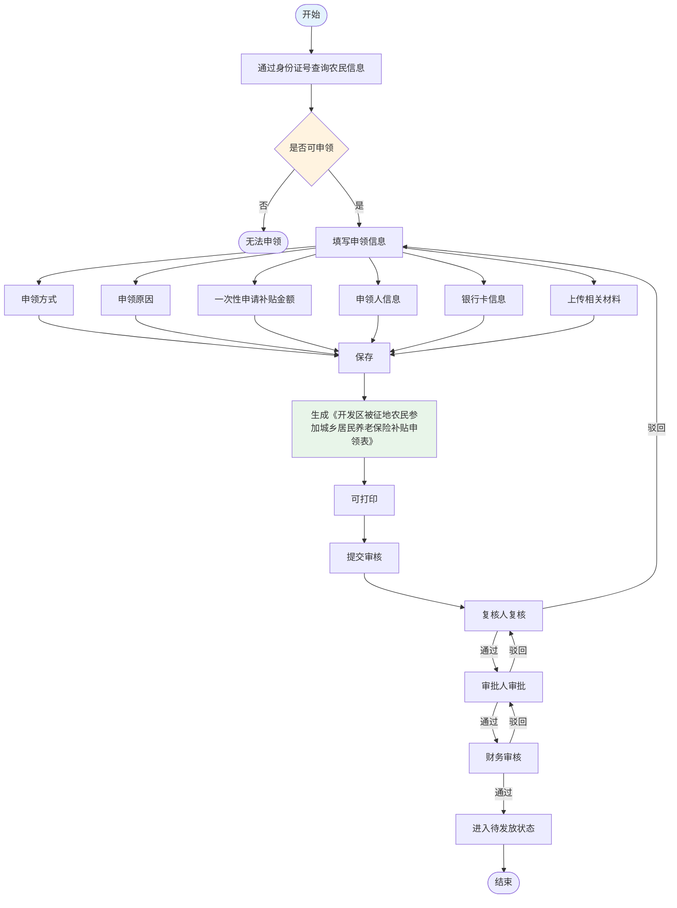
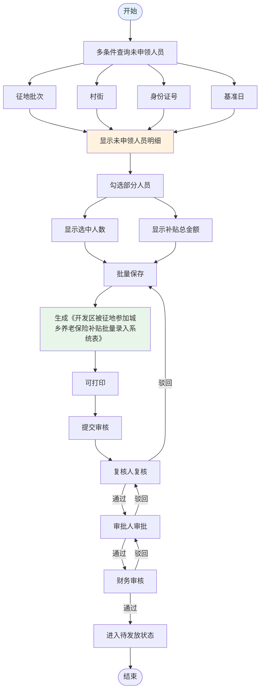
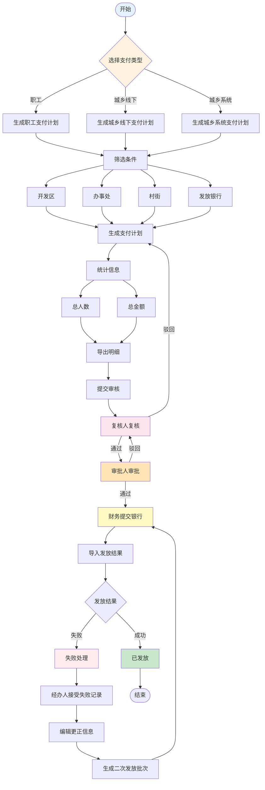
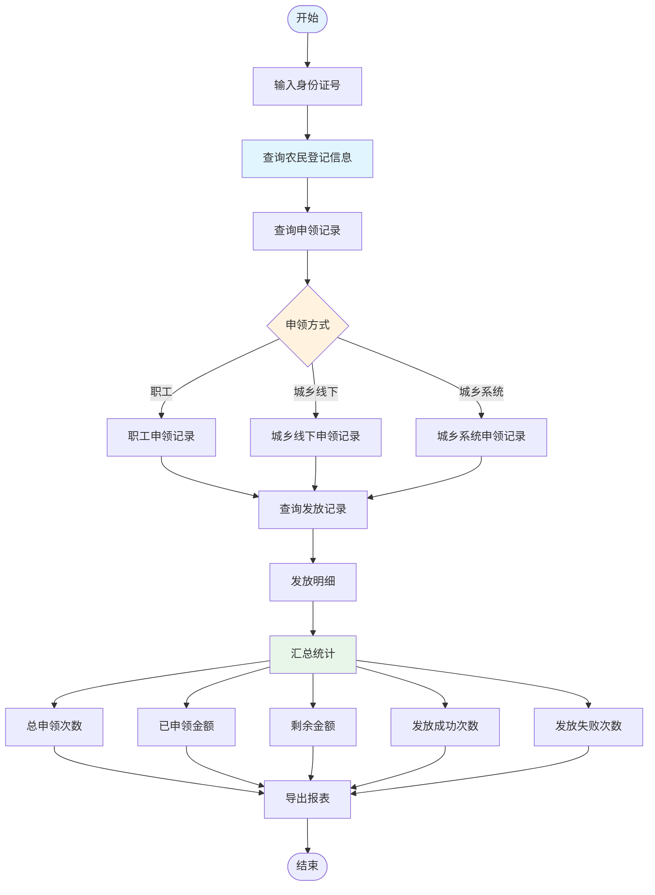

# 被征地参保补贴模块重构设计文档

**文档版本**: v1.0  
**创建日期**: 2026-01-24  
**设计阶段**: 重构规划  

---

## 一、背景分析

### 1.1 问题定义

被征地参保补贴与现有5种补贴类型（失地居民、被征地居民、拆迁居民、村干部、教龄补助）存在显著差异，无法简单复用现有流程，需要单独设计和实现。

### 1.2 核心差异分析

| 差异维度 | 现有补贴类型 | 被征地参保补贴 |
|---------|-------------|--------------|
| **业务流程** | 登记→核定→发放 | 登记（含条件判断）→申领（三种方式）→支付计划（三类） |
| **数据模型** | 基础人员信息 | 需存储征地批次、基准日、职工身份缴纳月数、灵活就业月数、补贴方式选择等大量额外信息 |
| **计算逻辑** | 固定标准或简单计算 | 系统自动计算年龄、补贴年限（按年龄计算后核减参加职工缴费年限）、补贴金额 |
| **表单输出** | 统一发放凭证 | 三种不同的申领表（职工、城乡线下、城乡系统） |
| **支付分类** | 按补贴类型统一发放 | 按申领方式分三类（职工、城乡线下、城乡系统） |

### 1.3 重构策略

采用**独立模块策略**，新建专门的数据库表、后端服务和前端组件，与现有5种补贴类型完全隔离，确保：
1. 不影响现有功能
2. 更好地满足特殊业务需求
3. 便于未来独立维护和扩展

---

## 二、业务流程设计

### 2.1 被征地农民登记流程



**字段说明**：

| 字段类别 | 字段名称 | 是否必填 | 说明 |
|---------|---------|---------|------|
| **基础信息** | 姓名、性别、身份证号 | 是 | 基本身份信息 |
| | 村委会、街道办事处 | 是 | 行政区划信息 |
| | 户籍所在地 | 是 | 户籍地址 |
| **征地信息** | 征地批次 | 是 | 征地批次编号 |
| | 征地时间 | 是 | 征地发生时间 |
| | 完成补偿时间 | 是 | 补偿完成时间 |
| | 基准日 | 是 | 政策基准日 |
| | 被征地农民认定时间 | 是 | 认定时间 |
| **条件判断** | 是否符合条件 | 是 | 是/否 |
| | 不符合条件原因 | 条件否时必填 | 原因说明 |
| | 是否申请 | 是 | 是/否 |
| | 未申请原因 | 申请否时必填 | 原因说明 |
| **申请详情** | 职工身份缴纳职工养老月数 | 申请是时必填 | 职工养老缴费月数 |
| | 灵活就业身份缴纳职工养老月数 | 申请是时必填 | 灵活就业缴费月数 |
| | 已领取困难人员社保补贴年限 | 申请是时必填 | 已领取年限 |
| **系统计算** | 截至基准日的年龄 | 自动计算 | 根据身份证号和基准日 |
| | 被征地参保补贴年限 | 自动计算 | 按年龄计算后核减职工缴费年限 |
| | 补贴金额 | 自动计算 | 补贴年限×标准 |
| **补贴方式** | 补贴方式 | 是 | 参加城乡居保/参加职工养老 |

**计算规则**：

```java
// 1. 计算截至基准日的年龄
年龄 = 基准日年份 - 出生年份

// 2. 计算被征地参保补贴年限
基础年限 = if (年龄 >= 60) then 15
           else if (年龄 >= 50) then (60 - 年龄)
           else 10

核减年限 = (职工身份缴纳月数 + 灵活就业缴纳月数) / 12

补贴年限 = MAX(基础年限 - 核减年限, 0)

// 3. 计算补贴金额
补贴金额 = 补贴年限 × 补贴标准（从系统参数读取）
```

### 2.2 补贴申领流程

#### 2.2.1 被征地参保补贴申领（职工）



**字段说明**：

| 字段名称 | 是否必填 | 说明 |
|---------|---------|------|
| 申领原因 | 是 | 申领原因说明 |
| 本次补贴申领金额 | 是 | 本次申领金额，不能超过余额 |
| 补贴余额 | 自动计算 | 总补贴金额 - 已申领金额 |
| 申领人 | 是 | 申领人姓名 |
| 与被征地农民关系 | 是 | 与农民的关系 |
| 银行卡 | 是 | 银行名称 |
| 银行卡号 | 是 | 银行账号 |
| 相关材料 | 否 | 上传附件 |

#### 2.2.2 被征地参保补贴申领（城乡线下）



**特有字段**：

| 字段名称 | 是否必填 | 说明 |
|---------|---------|------|
| 申领方式 | 是 | 城乡线下特有字段 |
| 一次性申请补贴金额 | 是 | 一次性申领金额 |

#### 2.2.3 被征地参保补贴申领（城乡系统）



**功能特点**：
1. 支持多条件组合查询
2. 支持批量勾选
3. 实时显示统计信息
4. 批量生成申领记录

### 2.3 支付计划生成流程



**三类支付计划**：

| 支付类型 | 说明 | 筛选条件 | 生成对象 |
|---------|------|---------|---------|
| 被征地参保补贴（职工） | 职工养老申领 | 开发区、办事处、村街、发放银行 | 职工申领记录 |
| 被征地参保补贴（城乡线下） | 城乡居保线下申领 | 开发区、办事处、村街、发放银行 | 城乡线下申领记录 |
| 被征地参保补贴（城乡系统） | 城乡居保系统申领 | 开发区、办事处、村街、发放银行 | 城乡系统申领记录 |

### 2.4 综合查询功能



### 2.5 关键业务规则与校验口径（补充）

#### 2.5.1 登记阶段（`land_acquisition_farmer`）
- **条件联动必填**：
  - `is_qualified=0` 时：必须填写 `unqualified_reason`，且**不允许**进入“是否申请/申领”流程。
  - `is_qualified=1` 且 `is_applied=0` 时：必须填写 `unapplied_reason`，且**不允许**创建任何申领单。
  - `is_qualified=1` 且 `is_applied=1` 时：必须填写缴费月数/已领取年限等字段，系统完成自动计算后方可提交复核。
- **自动计算**：
  - 年龄：按身份证生日与 `base_date` 计算（以“满周岁”口径为准）。
  - 补贴年限：按政策规则计算后，核减 \((employee_pension_months + flexible_employment_months) / 12\)（不足 12 个月按小数或向下取整需由政策明确）。
  - 计算结果不得为负：`subsidy_years = max(基础年限 - 核减年限, 0)`，金额同理。

#### 2.5.2 申领阶段（`land_acquisition_subsidy_claim`）
- **可申领前置条件**（任一不满足则拒绝创建/提交）：
  - 登记审核状态为“已通过”，且 `is_qualified=1`、`is_applied=1`
  - 本次申领金额 `claim_amount` 不得超过 `remaining_amount`
  - 与登记的 `subsidy_method` 选择一致（例如选择参加职工养老时，不允许走城乡口径）
- **城乡系统批量**（`claim_type=3`）：
  - “未申领名单”= 满足可申领前置条件 且 尚未存在同一 `base_date+acquisition_batch+claim_type=3` 的申领记录（或同一 `claim_batch_no` 已锁定）
  - 批量保存必须生成 `claim_batch_no`，并把本次勾选的每条申领记录绑定到同一 `claim_batch_no`，用于打印《批量录入系统表》

#### 2.5.3 支付计划与发放（`land_acquisition_payment_plan/detail`）
- 支付计划按 `payment_type` 三类生成；每条明细绑定一个申领记录（`claim_id`）。
- 银行导入结果匹配优先使用：`claim_no` / 身份证号 + 银行账号 + 金额（按银行回盘字段确定匹配规则）。
- 失败重发：建议生成新的 `payment_plan` 批次，并将失败明细“复制生成新明细”（`retry_from_detail_id` 指向来源）。

---

## 三、数据库设计

### 3.1 被征地农民登记表 (land_acquisition_farmer)

```sql
CREATE TABLE land_acquisition_farmer (
    id BIGINT AUTO_INCREMENT PRIMARY KEY COMMENT '主键ID',
    
    -- 基础信息
    name VARCHAR(50) NOT NULL COMMENT '姓名',
    gender CHAR(1) COMMENT '性别(0男 1女)',
    id_card VARCHAR(18) NOT NULL UNIQUE COMMENT '身份证号',
    village_committee_id BIGINT COMMENT '村委会ID',
    street_office_id BIGINT COMMENT '街道办事处ID',
    household_location VARCHAR(200) COMMENT '户籍所在地',
    
    -- 征地信息
    acquisition_batch VARCHAR(50) COMMENT '征地批次',
    acquisition_date DATE COMMENT '征地时间',
    compensation_completion_date DATE COMMENT '完成补偿时间',
    base_date DATE COMMENT '基准日',
    farmer_identification_date DATE COMMENT '被征地农民认定时间',
    
    -- 条件判断
    is_qualified CHAR(1) DEFAULT '0' COMMENT '是否符合条件(0否 1是)',
    unqualified_reason VARCHAR(500) COMMENT '不符合条件的原因',
    is_applied CHAR(1) DEFAULT '0' COMMENT '是否申请(0否 1是)',
    unapplied_reason VARCHAR(500) COMMENT '未申请原因',
    
    -- 申请详细信息（仅在is_applied=1时填写）
    employee_pension_months INT DEFAULT 0 COMMENT '职工身份缴纳职工养老月数',
    flexible_employment_months INT DEFAULT 0 COMMENT '灵活就业身份缴纳职工养老月数',
    subsidy_years_received DECIMAL(5,2) DEFAULT 0 COMMENT '已领取困难人员社会保险补贴年限',
    
    -- 系统自动计算项
    age_at_base_date INT COMMENT '截至基准日的年龄（系统自动计算）',
    subsidy_years DECIMAL(5,2) COMMENT '被征地参保补贴年限（系统自动计算）',
    subsidy_amount DECIMAL(15,2) COMMENT '补贴金额（系统自动计算）',
    
    -- 补贴方式选择
    subsidy_method CHAR(1) COMMENT '补贴方式(1参加城乡居保 2参加职工养老)',
    
    -- 审批状态
    approval_status VARCHAR(20) DEFAULT 'draft' COMMENT '审批状态',
    
    -- 审计字段
    remark VARCHAR(500) COMMENT '备注',
    create_by VARCHAR(64) DEFAULT '' COMMENT '创建者',
    create_time DATETIME DEFAULT CURRENT_TIMESTAMP COMMENT '创建时间',
    update_by VARCHAR(64) DEFAULT '' COMMENT '更新者',
    update_time DATETIME DEFAULT CURRENT_TIMESTAMP ON UPDATE CURRENT_TIMESTAMP COMMENT '更新时间',
    del_flag CHAR(1) DEFAULT '0' COMMENT '删除标志(0正常 1删除)',
    
    INDEX idx_id_card (id_card),
    INDEX idx_acquisition_batch (acquisition_batch),
    INDEX idx_approval_status (approval_status),
    INDEX idx_village (village_committee_id),
    INDEX idx_street (street_office_id)
) ENGINE=InnoDB DEFAULT CHARSET=utf8mb4 COMMENT='被征地农民登记表';
```

### 3.2 被征地参保补贴申领表 (land_acquisition_subsidy_claim)

```sql
CREATE TABLE land_acquisition_subsidy_claim (
    id BIGINT AUTO_INCREMENT PRIMARY KEY COMMENT '主键ID',

    -- 单据标识（用于打印/幂等/追溯）
    claim_no VARCHAR(50) NOT NULL UNIQUE COMMENT '申领单号',
    idempotency_key VARCHAR(64) COMMENT '幂等键（可由前端生成，防重复提交）',
    
    -- 关联信息
    farmer_id BIGINT NOT NULL COMMENT '被征地农民ID',
    farmer_id_card VARCHAR(18) NOT NULL COMMENT '被征地农民身份证号（冗余字段便于查询）',
    farmer_name VARCHAR(50) NOT NULL COMMENT '被征地农民姓名（冗余字段）',

    -- 查询/打印口径冗余（便于“城乡系统批量申领”与报表）
    base_date DATE COMMENT '基准日（冗余字段）',
    acquisition_batch VARCHAR(50) COMMENT '征地批次（冗余字段）',
    
    -- 申领方式：1-职工 2-城乡线下 3-城乡系统
    claim_type CHAR(1) NOT NULL COMMENT '申领方式(1职工 2城乡线下 3城乡系统)',

    -- 城乡系统批量申领标识（claim_type=3 时使用，用于生成《批量录入系统表》）
    claim_batch_no VARCHAR(50) COMMENT '批量申领单号（城乡系统专用）',
    
    -- 申领信息
    claim_reason VARCHAR(200) COMMENT '申领原因',
    claim_amount DECIMAL(15,2) NOT NULL COMMENT '本次补贴申领金额',
    remaining_amount DECIMAL(15,2) COMMENT '补贴余额',
    
    -- 申领人信息
    claimant_name VARCHAR(50) NOT NULL COMMENT '申领人',
    claimant_relationship VARCHAR(50) COMMENT '与被征地农民关系',
    
    -- 银行信息
    bank_name VARCHAR(100) COMMENT '银行名称',
    bank_account VARCHAR(50) COMMENT '银行卡号',
    
    -- 材料上传
    attachment_files TEXT COMMENT '相关材料文件路径（JSON格式）',

    -- 打印/审批快照（避免后续人员信息变更影响历史单据）
    print_template_code VARCHAR(50) COMMENT '打印模板编码（EMPLOYEE/URBAN_OFFLINE/URBAN_SYSTEM）',
    snapshot_json LONGTEXT COMMENT '打印/审批快照(JSON)',
    
    -- 城乡线下特有字段
    claim_method VARCHAR(50) COMMENT '申领方式（城乡线下专用）',
    lump_sum_amount DECIMAL(15,2) COMMENT '一次性申请补贴金额（城乡线下专用）',
    
    -- 审批状态
    approval_status VARCHAR(20) DEFAULT 'draft' COMMENT '审批状态',
    submit_time DATETIME COMMENT '提交时间',
    review_time DATETIME COMMENT '复核时间',
    approve_time DATETIME COMMENT '审批时间',
    finance_time DATETIME COMMENT '财务审核时间',
    
    -- 审计字段
    remark VARCHAR(500) COMMENT '备注',
    create_by VARCHAR(64) DEFAULT '' COMMENT '创建者',
    create_time DATETIME DEFAULT CURRENT_TIMESTAMP COMMENT '创建时间',
    update_by VARCHAR(64) DEFAULT '' COMMENT '更新者',
    update_time DATETIME DEFAULT CURRENT_TIMESTAMP ON UPDATE CURRENT_TIMESTAMP COMMENT '更新时间',
    del_flag CHAR(1) DEFAULT '0' COMMENT '删除标志(0正常 1删除)',
    
    FOREIGN KEY (farmer_id) REFERENCES land_acquisition_farmer(id),
    INDEX idx_farmer_id (farmer_id),
    INDEX idx_farmer_id_card (farmer_id_card),
    INDEX idx_claim_type (claim_type),
    INDEX idx_claim_batch_no (claim_batch_no),
    INDEX idx_approval_status (approval_status)
) ENGINE=InnoDB DEFAULT CHARSET=utf8mb4 COMMENT='被征地参保补贴申领表';
```

### 3.3 被征地参保补贴支付计划表 (land_acquisition_payment_plan)

```sql
CREATE TABLE land_acquisition_payment_plan (
    id BIGINT AUTO_INCREMENT PRIMARY KEY COMMENT '主键ID',
    
    -- 批次信息
    batch_no VARCHAR(50) NOT NULL UNIQUE COMMENT '批次号',
    idempotency_key VARCHAR(64) COMMENT '幂等键（防重复生成同一批次）',
    payment_type CHAR(1) NOT NULL COMMENT '支付类型(1职工 2城乡线下 3城乡系统)',
    payment_month DATE COMMENT '支付月份',
    
    -- 统计信息
    total_count INT DEFAULT 0 COMMENT '总人数',
    total_amount DECIMAL(15,2) DEFAULT 0.00 COMMENT '总金额',
    
    -- 筛选条件
    development_zone VARCHAR(100) COMMENT '开发区',
    street_office VARCHAR(100) COMMENT '办事处',
    village_committee VARCHAR(100) COMMENT '村街',
    bank_name VARCHAR(100) COMMENT '发放银行',
    
    -- 审批状态
    approval_status VARCHAR(20) DEFAULT 'draft' COMMENT '审批状态',
    submit_time DATETIME COMMENT '提交时间',
    review_time DATETIME COMMENT '复核时间',
    approve_time DATETIME COMMENT '审批时间',
    finance_time DATETIME COMMENT '财务提交时间',
    bank_submit_time DATETIME COMMENT '提交银行时间',

    -- 导出/打印快照（支付计划/批量表/银行模板）
    print_template_code VARCHAR(50) COMMENT '导出/打印模板编码',
    snapshot_json LONGTEXT COMMENT '导出/打印快照(JSON)',
    
    -- 审计字段
    remark VARCHAR(500) COMMENT '备注',
    create_by VARCHAR(64) DEFAULT '' COMMENT '创建者',
    create_time DATETIME DEFAULT CURRENT_TIMESTAMP COMMENT '创建时间',
    update_by VARCHAR(64) DEFAULT '' COMMENT '更新者',
    update_time DATETIME DEFAULT CURRENT_TIMESTAMP ON UPDATE CURRENT_TIMESTAMP COMMENT '更新时间',
    del_flag CHAR(1) DEFAULT '0' COMMENT '删除标志(0正常 1删除)',
    
    INDEX idx_batch_no (batch_no),
    INDEX idx_payment_type (payment_type),
    INDEX idx_approval_status (approval_status),
    INDEX idx_payment_month (payment_month)
) ENGINE=InnoDB DEFAULT CHARSET=utf8mb4 COMMENT='被征地参保补贴支付计划表';
```

### 3.4 被征地参保补贴支付明细表 (land_acquisition_payment_detail)

```sql
CREATE TABLE land_acquisition_payment_detail (
    id BIGINT AUTO_INCREMENT PRIMARY KEY COMMENT '主键ID',
    
    -- 关联信息
    plan_id BIGINT NOT NULL COMMENT '支付计划ID',
    claim_id BIGINT NOT NULL COMMENT '申领ID',
    farmer_id BIGINT NOT NULL COMMENT '被征地农民ID',
    
    -- 人员信息（冗余字段便于查询和导出）
    farmer_name VARCHAR(50) NOT NULL COMMENT '姓名',
    farmer_id_card VARCHAR(18) NOT NULL COMMENT '身份证号',
    bank_name VARCHAR(100) COMMENT '银行名称',
    bank_account VARCHAR(50) COMMENT '银行卡号',
    
    -- 支付信息
    payment_amount DECIMAL(15,2) NOT NULL COMMENT '支付金额',
    payment_status VARCHAR(20) DEFAULT 'pending' COMMENT '支付状态(pending待支付 success成功 failed失败)',
    payment_time DATETIME COMMENT '支付时间',
    failure_reason VARCHAR(200) COMMENT '失败原因',
    bank_trade_no VARCHAR(100) COMMENT '银行交易流水号（导入结果匹配）',
    retry_from_detail_id BIGINT COMMENT '重发来源明细ID（可选，用于追溯）',
    
    -- 审计字段
    create_time DATETIME DEFAULT CURRENT_TIMESTAMP COMMENT '创建时间',
    update_time DATETIME DEFAULT CURRENT_TIMESTAMP ON UPDATE CURRENT_TIMESTAMP COMMENT '更新时间',
    
    FOREIGN KEY (plan_id) REFERENCES land_acquisition_payment_plan(id),
    FOREIGN KEY (claim_id) REFERENCES land_acquisition_subsidy_claim(id),
    FOREIGN KEY (farmer_id) REFERENCES land_acquisition_farmer(id),
    INDEX idx_plan_id (plan_id),
    INDEX idx_claim_id (claim_id),
    INDEX idx_farmer_id (farmer_id),
    INDEX idx_payment_status (payment_status)
) ENGINE=InnoDB DEFAULT CHARSET=utf8mb4 COMMENT='被征地参保补贴支付明细表';
```

### 3.5 数据字典

```sql
-- 被征地农民条件判断字典
INSERT INTO sys_dict_type VALUES (NULL, '被征地农民条件判断', 'land_acquisition_qualified', '0', 'admin', NOW(), '', NULL, '被征地农民是否符合条件');
INSERT INTO sys_dict_data VALUES (NULL, 1, '否', '0', 'land_acquisition_qualified', '', 'danger', 'N', '0', 'admin', NOW(), '', NULL, '不符合条件');
INSERT INTO sys_dict_data VALUES (NULL, 2, '是', '1', 'land_acquisition_qualified', '', 'success', 'N', '0', 'admin', NOW(), '', NULL, '符合条件');

-- 被征地补贴申领方式字典
INSERT INTO sys_dict_type VALUES (NULL, '被征地补贴申领方式', 'land_acquisition_claim_type', '0', 'admin', NOW(), '', NULL, '被征地参保补贴申领方式');
INSERT INTO sys_dict_data VALUES (NULL, 1, '职工', '1', 'land_acquisition_claim_type', '', 'primary', 'N', '0', 'admin', NOW(), '', NULL, '参加企业职工养老保险');
INSERT INTO sys_dict_data VALUES (NULL, 2, '城乡线下', '2', 'land_acquisition_claim_type', '', 'info', 'N', '0', 'admin', NOW(), '', NULL, '参加城乡居民养老保险（线下）');
INSERT INTO sys_dict_data VALUES (NULL, 3, '城乡系统', '3', 'land_acquisition_claim_type', '', 'warning', 'N', '0', 'admin', NOW(), '', NULL, '参加城乡居民养老保险（系统）');

-- 被征地补贴方式字典
INSERT INTO sys_dict_type VALUES (NULL, '被征地补贴方式', 'land_acquisition_subsidy_method', '0', 'admin', NOW(), '', NULL, '被征地参保补贴方式');
INSERT INTO sys_dict_data VALUES (NULL, 1, '参加城乡居保', '1', 'land_acquisition_subsidy_method', '', 'primary', 'N', '0', 'admin', NOW(), '', NULL, '选择参加城乡居民养老保险');
INSERT INTO sys_dict_data VALUES (NULL, 2, '参加职工养老', '2', 'land_acquisition_subsidy_method', '', 'success', 'N', '0', 'admin', NOW(), '', NULL, '选择参加职工养老保险');
```

---

## 四、菜单结构设计

### 4.1 经办人菜单

在现有菜单基础上增加：

```
人员信息管理
  └─ 被征地农民登记

支付结算
  ├─ 被征地参保补贴申领（职工）
  ├─ 被征地参保补贴申领（城乡线下）
  ├─ 被征地参保补贴申领（城乡系统）
  └─ 生成被征地参保补贴支付计划
```

### 4.2 复核人菜单

在现有菜单基础上增加：

```
支付结算
  └─ 被征地参保补贴支付计划复核
```

### 4.3 审批人菜单

在现有菜单基础上增加：

```
支付结算
  └─ 被征地参保补贴支付计划审批
```

### 4.4 财务人员菜单

在现有菜单基础上增加：

```
财务发放
  ├─ 被征地参保补贴发放批次管理
  └─ 被征地参保补贴失败处理
```

### 4.5 统计管理员菜单

在现有菜单基础上增加：

```
综合查询
  └─ 被征地参保补贴综合查询
```

---

## 五、实施计划

### 5.1 阶段划分

| 阶段 | 任务 | 工期 | 复杂度 |
|-----|------|------|--------|
| **阶段一** | 数据库设计 | 2天 | 6/10 |
| **阶段二** | 后端开发 | 5天 | 7/10 |
| **阶段三** | 前端开发 | 6天 | 8/10 |
| **阶段四** | 测试与优化 | 3天 | 6/10 |
| **阶段五** | 文档与培训 | 2天 | 4/10 |

**总计**：18个工作日（约4周）

### 5.2 优先级划分

**P0（最高优先级）**：
- 被征地农民登记功能
- 补贴申领（职工）功能
- 支付计划生成（职工）
- 基础审批流程

**P1（高优先级）**：
- 补贴申领（城乡线下）功能
- 补贴申领（城乡系统）功能
- 支付计划生成（三类）
- 综合查询功能

**P2（中优先级）**：
- 表单打印优化
- 批量操作优化
- 报表统计

### 5.3 与现有发放体系衔接决策（必须明确）

**结论**：被征地参保补贴采用**完全独立的“支付计划/支付明细/导入结果”链路**（即使用 `land_acquisition_payment_plan/detail`），不复用现有 `distribution_batch` / `shebao_subsidy_distribution` 体系。

**理由**：
1. **分类维度不同**：本业务支付计划需要按三类（职工/城乡线下/城乡系统）切分；强行映射到 `subsidy_type` 会导致语义混乱（且需要额外字段才能区分三类）。
2. **单据与打印强绑定**：三种申领单据与批量表要求保存“历史快照”，更适合独立表结构承载（`claim_no/claim_batch_no/snapshot_json`）。
3. **风险隔离**：独立链路可避免改动现有发放与失败重发逻辑，降低对存量功能影响。

**对外导出/导入兼容策略**：
- 导出银行模板字段保持与现有财务习惯一致（姓名、身份证号、银行账号、金额等），但数据来源为 `payment_detail`。
- 导入回盘后按 `claim_no`（优先）或（身份证号+账号+金额）匹配更新 `payment_detail.payment_status/failure_reason/bank_trade_no`。
- 失败重发：生成新 `payment_plan.batch_no`，从失败明细复制生成新明细并记录 `retry_from_detail_id` 以便追溯。

---

## 六、关键风险点

1. **计算逻辑复杂性**：补贴年限和金额的计算涉及多个因素，需要与用户充分确认计算规则
2. **数据迁移**：如果现有系统已有被征地居民数据，需要制定数据迁移方案
3. **表单打印**：三种不同的申领表格式需要精确还原
4. **审批流程**：需要确认三种申领方式的审批流程是否完全一致

---

## 七、后续优化方向

1. 与社保系统对接，自动获取职工养老缴费信息
2. 与征地管理系统对接，自动获取征地批次、征地时间等信息
3. 实现电子签章功能
4. 开发移动端申领功能

---

**文档结束**

本文档为被征地参保补贴模块的重构设计文档，详细说明了业务流程、数据库设计、菜单结构和实施计划。如有疑问或需要进一步讨论，请随时联系。
