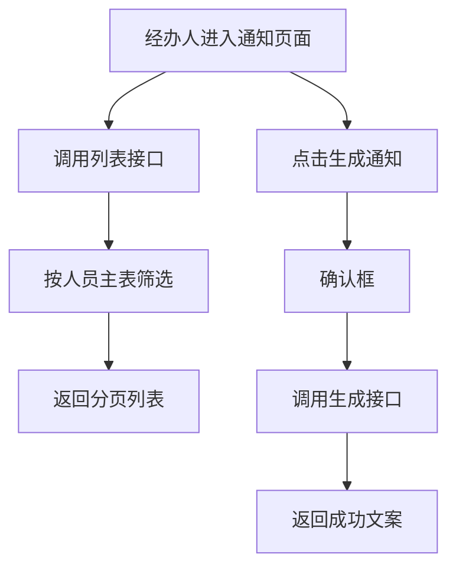
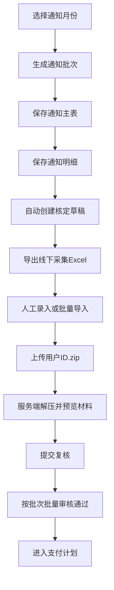

# 预到龄发放通知详细设计文档

**文档版本**: v2.0  
**创建日期**: 2026-03-15  
**适用范围**: 廊坊社保管理系统 / 待遇核定管理 / 预到龄发放通知  
**设计阶段**: 实施定稿

---

## 一、背景与目标

### 1.1 业务背景

预到龄发放通知用于在待遇核定前，对即将达到待遇领取年龄的被补贴人员进行预筛选和提醒，帮助经办人提前识别目标人员，并为后续待遇核定、材料准备和业务办理提供依据。

该功能位于“待遇核定管理”下游入口，业务上应起到“提前发现、提前提示、提前办理”的作用。

### 1.2 设计目标

本次实施目标不再停留在“查询+提示”，而是要形成从通知生成到支付计划的完整业务链路：

- 支持按 `通知月份` 生成预到龄通知批次
- 通知以“主表批次 + 子表明细”方式持久化
- 生成批次时自动为每名明细人员创建一条待遇核定草稿
- 支持按 `批次号` 在待遇核定页面进行单条录入和 Excel 批量导入
- 支持每名人员上传 `用户ID.zip`，服务端自动解压并在线预览图片材料
- 支持复核人按 `批次号` 抽查、逐条查看和批量审核通过
- 只有审核通过的核定记录才能进入支付计划
- 支持按月份、批次号导出 Excel 清单，便于线下收集和回填

### 1.3 范围与边界

当前文档分两层描述：

- `当前实现`：仓库中已存在并可实际执行的功能
- `目标设计`：从业务可用性角度应具备，但当前代码尚未完整实现的能力

本文档默认以当前代码为事实基线，不把未实现能力写成已实现。

---

## 二、角色与职责

| 角色 | 职责 |
|------|------|
| 经办人 | 按月份生成通知批次、查看批次明细、导出 Excel、录入或导入核定信息、上传材料 ZIP |
| 复核人 | 按批次号筛选待复核核定记录、抽查身份证号与银行卡号、查看材料图片、批量审核通过 |
| 支付计划经办人 | 基于已审核通过的核定记录生成支付计划 |
| 系统管理员 | 维护权限、模板、附件目录与导入导出规范，处理异常数据 |

---

## 三、业务流程设计

### 3.1 当前实现流程

### 3.2 实施版业务流程

### 3.3 状态机设计

本次实施采用三层状态：

| 层级 | 字段 | 状态 |
|------|------|------|
| 通知批次 | `batchStatus` | `generated`、`processing`、`completed` |
| 通知明细 | `determinationStatus` | `draft`、`pending_review`、`approved`、`rejected`、`payment_generated` |
| 待遇核定 | `approvalStatus` | `draft`、`pending_review`、`approved`、`rejected` |

核心流转规则：

- 生成通知批次时，通知明细和待遇核定草稿一并创建
- 经办人录入完整信息并提交后，核定记录进入 `pending_review`
- 复核人按批次批量审核通过后，核定记录进入 `approved`
- 进入支付计划后，通知明细同步更新为 `payment_generated`

---

## 四、页面与交互设计

### 4.1 页面入口

- 一级菜单：`待遇核定管理`
- 二级菜单：`预到龄发放通知`
- 前端页面：`ruoyi-ui/src/views/shebao/benefit/notice/index.vue`

### 4.2 页面结构

实施后页面由三部分组成：

1. 批次生成区
2. 批次查询区
3. 批次明细抽屉/弹窗

### 4.3 批次生成区域

实施后字段：

| 字段 | 类型 | 行为 | 说明 |
|------|------|------|------|
| 通知月份 | 月份选择器 | 必填 | 表示通知业务月份，如 `2026-03` |
| 年龄阈值 | 数字输入 | 默认 60 | 用于计算到龄年龄 |
| 预到龄提前月数 | 固定规则 | 默认 3 | 通知月份 + 3 个月 = 实际到龄月份 |
| 生成通知 | 按钮 | 幂等生成 | 已存在同月批次时提示并返回现有批次 |

### 4.4 查询区域

实施后查询条件：

| 字段 | 类型 | 说明 |
|------|------|------|
| 通知月份 | 月份选择器 | 查询业务月份 |
| 批次号 | 输入框 | 精确或模糊查询批次 |
| 生成状态 | 下拉框 | 查询已生成/处理中/已完成批次 |

### 4.5 批次列表字段

| 列名 | 来源 | 说明 |
|------|------|------|
| 批次号 | `shebao_benefit_notice_batch.batch_no` | 业务主键 |
| 通知月份 | `notice_month` | 当前通知业务月份 |
| 到龄月份 | `retirement_month` | 通知月份 + 3个月 |
| 总人数 | `total_count` | 当前批次涉及人数 |
| 待复核人数 | 聚合值 | 当前批次下待复核核定数 |
| 已通过人数 | 聚合值 | 当前批次下已通过核定数 |
| 生成状态 | `batch_status` | 批次当前状态 |
| 生成人 | `create_by` | 操作人 |
| 生成时间 | `create_time` | 生成时间 |

### 4.6 批次详情字段

| 列名 | 说明 |
|------|------|
| 姓名 | 被补贴人姓名 |
| 身份证号 | 人员身份证号 |
| 用户编号 | 用户唯一编号 |
| 到龄日期 | 满 60 周岁日期 |
| 补贴类型 | 当前识别出的补贴类型 |
| 核定状态 | 与待遇核定状态同步 |
| 材料状态 | 是否已上传并解压材料 |
| 复核状态 | 是否已通过复核 |

### 4.7 核定页交互设计

待遇核定页面实施后新增能力：

- 支持按 `通知批次号` 检索
- 对批次内人员逐条录入身份证号、银行名称、银行卡号、账户名
- 支持下载导入模板
- 支持 Excel 批量导入
- 支持同一导入操作内同时上传多份 `用户ID.zip`
- 详情页支持在线预览身份证、银行卡等图片

### 4.8 审核页交互设计

待遇核定复核页面实施后新增能力：

- 支持按 `通知批次号` 检索待复核人员
- 支持单条详情抽查
- 支持查看材料图片和原 ZIP 下载
- 支持多选和批量审核通过
- 驳回时要求填写原因

### 4.9 当前交互限制

- 页面没有“重置”按钮
- 页面没有“详情”或“导出”按钮
- 页面没有“生成结果明细”
- 页面没有按钮级权限控制
- 页面 `loading` 没有统一错误兜底

---

## 五、关键业务规则与校验口径

### 5.1 批次生成人员规则

实施版采用确定性口径：

- `noticeMonth` 表示通知业务月份，如 `2026-03`
- `retirementMonth = noticeMonth + 3个月`
- 满足以下条件的人员进入本批次：
  - `del_flag = '0'`
  - `is_alive = '1'`
  - `approval_status = 'approved'`
  - `birthday + ageThreshold 年` 所在年月 = `retirementMonth`

同一人员同一批次只允许存在一条通知明细。

### 5.2 批次生成规则

生成通知时同时执行：

1. 创建或复用当月通知批次
2. 计算当前批次应通知人员
3. 为每名人员写入通知明细
4. 自动创建一条待遇核定草稿并与明细关联
5. 返回批次号、人数统计和是否复用旧批次

### 5.3 附件规则

- 单人材料包命名规则：`用户ID.zip`
- ZIP 解压后只提取白名单图片格式：`jpg`、`jpeg`、`png`、`webp`
- 解压目录规则：`/profile/benefit/determination/{noticeBatchNo}/{userId}/`
- 预览优先显示身份证、银行卡等关键材料图片
- 原 ZIP 始终保留，详情页可下载

### 5.4 导入校验规则

Excel 批量导入时至少校验：

- 批次号不能为空且必须存在
- 用户 ID 必须存在且属于当前批次
- 身份证号不能为空且格式正确
- 银行卡号不能为空
- 同一人员在同一批次下不能重复导入
- 可选材料 ZIP 文件名需与 `用户ID.zip` 对应

---

## 六、接口设计

### 6.1 列表接口

**接口地址**

`GET /shebao/benefit/notice/list`

**权限**

`shebao:benefit:notice:list`

**请求参数**

| 参数 | 类型 | 必填 | 说明 |
|------|------|------|------|
| `noticeMonth` | `yyyy-MM` | 否 | 通知月份 |
| `pageNum` | Integer | 否 | 页码，默认 1 |
| `pageSize` | Integer | 否 | 每页大小，默认 10 |

**返回字段**

| 字段 | 说明 |
|------|------|
| `subsidyPersonId` | 被补贴人主键 |
| `name` | 姓名 |
| `idCardNo` | 身份证号 |
| `currentAge` | 当前年龄 |
| `retirementDate` | 到龄日期 |
| `noticeMonth` | 通知月份 |
| `notified` | 通知状态标识，当前固定为 `false` |

### 6.2 生成接口

**接口地址**

`POST /shebao/benefit/notice/generate`

**权限**

`shebao:benefit:notice:generate`

**请求体**

当前前端会传：

| 字段 | 说明 |
|------|------|
| `noticeMonth` | 通知月份 |
| `ageThreshold` | 年龄阈值，默认 60 |

**当前返回**

- 成功消息
- 无业务明细
- 无生成批次

---

## 七、数据设计

### 7.1 依赖表

本次实施直接依赖：

- `shebao_subsidy_person`
- `shebao_street_office`
- `shebao_village_committee`
- `benefit_determination`

### 7.2 新增表设计

#### 7.2.1 `shebao_benefit_notice_batch`

| 字段 | 说明 |
|------|------|
| `id` | 主键 |
| `batch_no` | 批次号，业务唯一 |
| `notice_month` | 通知月份 |
| `retirement_month` | 到龄月份 |
| `age_threshold` | 年龄阈值 |
| `total_count` | 总人数 |
| `pending_review_count` | 待复核人数 |
| `approved_count` | 已通过人数 |
| `rejected_count` | 已驳回人数 |
| `batch_status` | 批次状态 |
| `create_by/create_time` | 生成人与生成时间 |
| `update_by/update_time` | 修改人和修改时间 |
| `del_flag` | 删除标志 |

#### 7.2.2 `shebao_benefit_notice_detail`

| 字段 | 说明 |
|------|------|
| `id` | 主键 |
| `notice_batch_id` | 批次主键 |
| `batch_no` | 批次号 |
| `subsidy_person_id` | 被补贴人 ID |
| `user_code` | 用户编号 |
| `name` | 姓名快照 |
| `id_card_no` | 身份证号快照 |
| `subsidy_type` | 补贴类型 |
| `birthday` | 出生日期 |
| `retirement_date` | 到龄日期 |
| `determination_id` | 关联待遇核定记录 |
| `determination_status` | 核定状态 |
| `material_status` | 材料状态 |
| `review_status` | 复核状态 |
| `remark` | 备注 |
| `create_by/create_time` | 创建信息 |
| `update_by/update_time` | 更新信息 |
| `del_flag` | 删除标志 |

#### 7.2.3 `shebao_benefit_attachment`

| 字段 | 说明 |
|------|------|
| `id` | 主键 |
| `business_type` | 业务类型，如 `benefit_determination` |
| `business_id` | 业务主键 |
| `notice_batch_no` | 批次号 |
| `subsidy_person_id` | 用户 ID |
| `original_file_name` | 原始 ZIP 名称 |
| `zip_file_path` | 原 ZIP 路径 |
| `extract_dir` | 解压目录 |
| `preview_image_paths` | 可预览图片路径列表 |
| `create_by/create_time` | 上传信息 |
| `update_by/update_time` | 更新信息 |
| `del_flag` | 删除标志 |

### 7.3 扩展 `benefit_determination`

需扩展以下持久化字段：

- `notice_batch_no`
- `notice_detail_id`
- `id_card_no`
- `review_by`
- `review_time`
- `review_remark`
- `material_zip_path`
- `material_extract_dir`
- `material_image_paths`
- `material_status`
- `payment_plan_generated`

### 7.4 关键索引

建议补充索引：

- 通知批次：`uk_batch_no`、`idx_notice_month`
- 通知明细：`uk_batch_person`、`idx_determination_status`
- 待遇核定：`idx_notice_batch_no`、`idx_notice_detail_id`、`idx_payment_plan_generated`

---

## 八、菜单与权限设计

### 8.1 当前菜单

当前菜单初始化文件中已配置：

- 菜单名称：`预到龄发放通知`
- 菜单路径：`notice`
- 组件：`shebao/benefit/notice/index`
- 页面权限：`shebao:benefit:notice:list`

### 8.2 权限拆分

建议按业务动作拆分：

- 页面访问：`shebao:benefit:notice:list`
- 批次生成：`shebao:benefit:notice:generate`
- 批次详情：`shebao:benefit:notice:query`
- Excel 导出：`shebao:benefit:notice:export`
- 核定导入：`shebao:benefit:determination:import`
- 材料上传：`shebao:benefit:determination:upload`
- 复核通过：`shebao:benefit:review:approve`
- 批量复核：`shebao:benefit:review:batchApprove`

---

## 九、异常场景与边界设计

### 9.1 需要重点关注的异常场景

- 通知月份为空或格式非法
- 同月重复生成批次
- 当前月份无匹配人员
- 批量导入 Excel 中用户 ID 不属于当前批次
- ZIP 文件名与 `用户ID.zip` 规则不一致
- ZIP 解压后没有图片
- 同一人员重复提交核定
- 已进入支付计划的数据再次审核或再次生成计划

### 9.2 主要实现风险

| 编号 | 风险 | 影响 |
|------|------|------|
| `NOTICE-V2-01` | 通知批次和核定草稿未同步创建 | 后续按批次核定无法闭环 |
| `NOTICE-V2-02` | ZIP 解压缺少安全校验 | 存在目录穿越和非法文件风险 |
| `NOTICE-V2-03` | Excel 导入缺少逐行错误提示 | 用户无法定位错误数据 |
| `NOTICE-V2-04` | 审核通过未联动明细状态 | 批次统计失真 |
| `NOTICE-V2-05` | 支付计划未做去重控制 | 可能重复生成支付数据 |

---

## 十、测试设计指引

本次实施后重点验证：

- 批次生成是否落库
- 明细是否与核定草稿一一关联
- 导出 Excel 是否一行一人
- Excel 导入是否能按批次回写核定信息
- ZIP 上传、解压、预览是否正常
- 批量审核通过是否能回写批次统计
- 支付计划是否仅能读取已通过核定记录

---

## 十一、结论

本实施版将“预到龄发放通知”定义为一条完整业务链：

- 以 `通知批次` 为入口
- 以 `通知明细 + 核定草稿` 为处理中间态
- 以 `批量审核通过` 为进入支付计划的前置条件

最终口径为：

`通知批次可查、明细可导、核定可录、材料可看、审核可批、计划可进。`
